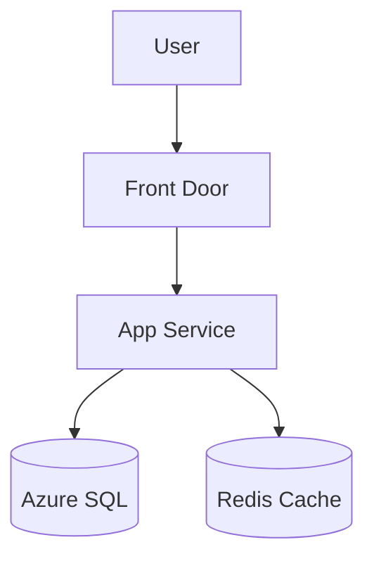
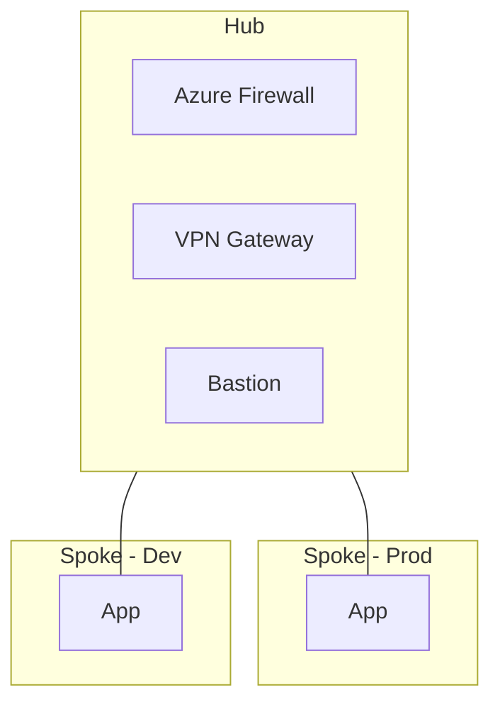
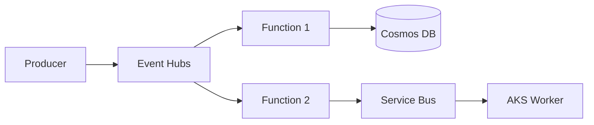
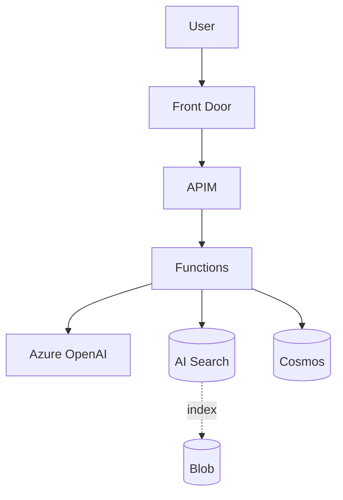

# Architecture Interview

사용자의 요구사항을 **구조화된 인터뷰**로 수집하고, 그 결과를 **의사결정용 산출물**로 변환합니다. 단순 다이어그램이 아니라 "이 결정을 왜 했는가"를 설명할 수 있는 ADR(Architecture Decision Record)을 함께 만드는 것이 목표입니다.

## 사용 시점
- 신규 워크로드 Azure 설계
- 기존 시스템 마이그레이션 청사진
- 후보 아키텍처 2-3개 비교 (의사결정 자료)
- 팀 합의용 다이어그램 작성
- ADR 문서 작성

복잡한 다단계 의사결정·WAF 깊은 검토는 `azure-architect` 에이전트로 위임. Bicep/Terraform 코드 생성은 각각 `bicep-generator`, `terraform-generator` 스킬로 위임.

## ⚠️ 안전 원칙

### 가짜 정보 금지
- 사용자가 답하지 않은 항목을 **추측으로 채우지 말 것**
- 모르는 항목은 "추가 조사 필요" 또는 "사용자 확인 필요"로 명시
- 비용 추정은 `mcp__azure__pricing` 결과만 사용, 어림짐작 금지

### 옵션 강요 금지
- 단일 정답을 제시하지 말 것 — 항상 2-3개 후보 + 명시적 trade-off
- 추천 표시(⭐)는 가능하지만 결정은 사용자에게

### 인터뷰 길이 자제
- 사용자 시간 존중 — 한 번에 모든 질문 X, 적응형 깊이
- "skip" / "기본값" / "나중에 결정" 옵션 항상 제공
- 5분 안에 1차 산출물이 나와야 함

## 워크플로우 (3-Phase)

### Phase 1: Triage (3분, 5–7개 질문)

목적: 후보 아키텍처 가지치기 (decision tree 상위 노드).

```
## 🎤 Phase 1: 빠른 트리아지 (5–7개 질문)

이 단계는 후보 아키텍처를 좁히기 위한 최소 질문입니다.
"잘 모르겠음" / "기본값" / "skip" 으로 답해도 됩니다.

1. **워크로드 종류**?
   - [ ] 웹/API (사용자 트래픽)
   - [ ] 배치/데이터 파이프라인
   - [ ] AI/LLM 애플리케이션
   - [ ] 이벤트 기반 (메시징·스트리밍)
   - [ ] 기타: ___

2. **사용자 규모**?
   - [ ] 사내 (~수백 명)
   - [ ] B2B (~수만 명)
   - [ ] B2C (~수십만+)
   - [ ] 모르겠음 → 중간 가정

3. **주 사용자 위치**?
   - [ ] 국내만
   - [ ] 국내 + 일본
   - [ ] 글로벌 (멀티 리전)

4. **기술 스택 선호**?
   - [ ] .NET / Java / Python / Node.js / Go / 기타: ___
   - [ ] 컨테이너 우선 / 서버리스 우선 / VM도 OK

5. **컴플라이언스 요구**?
   - [ ] 일반 / 개인정보보호법 / ISO 27001 / PCI-DSS / 금융권 / 기타

6. **예산 감각** (선택)?
   - [ ] 최소화 (~월 50만원)
   - [ ] 적정 (~월 500만원)
   - [ ] 안정성 우선 (예산 신경 안 씀)

7. **기존 Azure 자산** (선택)?
   - [ ] 신규 시작 / 기존 구독 활용 / 멀티 구독
```

답변 받은 뒤 **Phase 1 요약** 출력:

```
## 📋 트리아지 결과

| 항목 | 답변 |
|---|---|
| 워크로드 | B2C 웹 API |
| 규모 | ~10만 MAU |
| 위치 | 국내 + 일본 (DR) |
| 스택 | Java / Spring Boot, 컨테이너 선호 |
| 컴플라이언스 | 개인정보보호법 |
| 예산 | 적정 |

→ **후보 아키텍처 3개**: A) AKS 기반 / B) Container Apps 기반 / C) App Service 기반

Phase 2로 가시겠습니까? (하나의 후보를 선택하면 그것만 심화. "전부 비교"하면 셋 다 그립니다)
```

### Phase 2: Deep Dive (5–10분, 후보별 심화)

선택된 후보(들)에 대해 다음 카테고리를 질문:

#### A. 가용성 / 복원력
- RTO / RPO 목표 (시간/분/초 단위)
- 가용성 SLA (99.9% / 99.95% / 99.99%)
- 멀티 AZ / 멀티 리전 필요?
- 백업 보존 기간

#### B. 데이터
- 주 데이터 저장소 (관계형 vs NoSQL vs 둘 다)
- 데이터 양 (현재 / 1년 후)
- 트랜잭션 일관성 요구 강도
- 캐싱 / 검색 인덱스 필요?

#### C. 통합
- 기존 시스템 연동 (온프레미스, 다른 클라우드)
- 외부 API 의존성
- 메시징/이벤트 패턴

#### D. 보안 / Identity
- 사용자 인증 (Entra ID B2C / Auth0 / 자체)
- 비밀 관리 (Key Vault 사용 가정)
- 네트워크 격리 수준 (Private Endpoint 필수?)

#### E. 운영
- 모니터링 도구 선호 (Azure Monitor / Datadog / Grafana)
- IaC 도구 (Bicep / Terraform / 수동)
- CI/CD 파이프라인

각 항목마다 **현재까지 정해진 사항**을 표로 갱신해서 사용자에게 보여주기. 답변 패턴이 빠르면 한 번에 묶어서, 깊은 질문이면 하나씩.

### Phase 3: 산출물 (다이어그램 + ADR + 비용 + Terraform 권유)

다음 산출물을 **모두** 생성:

#### 산출물 1: 다층 다이어그램 (Mermaid 인라인 + Drawpyo Python → drawio)

**두 산출물을 동시 생성**합니다 (각 뷰마다):

1. **Mermaid 코드블록** — Claude Code 채팅에 인라인 미리보기 (즉시 검토용, 추상적 흐름 확인)
2. **Drawpyo Python 스크립트** — `./diagrams/<adr-id>-<view>.py` 로 저장. 사용자가 `python <name>.py` 실행하면 `<name>.drawio` 파일이 생성되고, drawio.com / drawio Desktop / VS Code drawio 확장에서 열어 **MS 공식 Azure 아이콘**으로 PNG/SVG로 렌더 — **MS Learn 스타일 의사결정 자료 품질**.

**왜 Drawpyo + drawio?**
- drawio가 Microsoft의 **공식 Azure SVG 아이콘셋**(`mxgraph.azure2.*`)을 native shape로 보유 → MS Learn 다이어그램과 시각적으로 동등
- Drawpyo가 좌표·스타일·XML 디테일을 캡슐화 → LLM이 좌표 잡으면 결과 들쭉날쭉한 문제 회피
- 결과물(`.drawio`)은 사용자가 추가 편집 가능 (drawio에서 자유롭게 수정/공유)
- SVG/PNG export → Confluence/Notion/GitHub Issue/PR 본문에 그대로 임베드

**폴백: D2** — 사용자가 Python 환경 못 쓰는 경우 D2 텍스트 파일도 함께 제공 (이 문서 하단의 "D2 폴백" 절 참조).

**의사결정용으로 잘 그리기 위한 규칙**:

1. **다층 뷰 - 최소 2개, 권장 4개**:
   - **Context** (가장 외곽: 사용자·외부 시스템·우리 워크로드)
   - **Component** (논리 컴포넌트 + 책임 + 핵심 SKU)
   - **Network** (VNet·Subnet·Private Endpoint·NSG·Firewall)
   - **Data Flow** (request/response 또는 event 흐름의 번호 매긴 시퀀스)

2. **Azure 카테고리 색상 클래스** — 한눈에 카테고리 구분:

```mermaid
%%{init: {'theme':'default'}}%%
flowchart TB
    classDef compute fill:#0078D4,stroke:#005A9E,color:#fff
    classDef data fill:#FF8C00,stroke:#CC7000,color:#fff
    classDef network fill:#107C10,stroke:#0B5C0B,color:#fff
    classDef identity fill:#5C2D91,stroke:#4A2475,color:#fff
    classDef integration fill:#00BCF2,stroke:#0095BD,color:#fff
    classDef monitoring fill:#737373,stroke:#525252,color:#fff
    classDef ai fill:#E81123,stroke:#A80E1B,color:#fff
```

3. **각 노드에 SKU + 월 비용** 라벨:
   ```
   AKS["AKS<br/>3× D4s_v5<br/>~₩520k/월"]:::compute
   ```

4. **그룹화** — 리전·환경·티어로 subgraph:
   ```mermaid
   subgraph "koreacentral (Primary)"
     subgraph "Production"
       ...
     end
   end
   ```

5. **데이터 흐름은 번호 매기기**:
   ```
   User -->|① HTTPS| AFD
   AFD -->|② cached?| CDN
   AFD -->|③ origin| APIM
   ```

6. **여러 후보 비교 시** — 같은 viewport에 나란히 배치 후, 본문 표로 차이 정리.

**예시 — Context 뷰**:


**예시 — Component 뷰** (B2C 웹 API + AKS):


**Drawpyo Python 스크립트 — 의사결정용 (MS Learn 스타일 산출물)**

스킬은 다음과 같은 self-contained Python 스크립트를 `./diagrams/<adr-id>-component.py` 로 생성합니다. 사용자는 `pip install drawpyo` 한 번 + `python <name>.py` 실행 → `.drawio` 파일이 자동 생성됨 → drawio에서 열어 PNG/SVG export.

```python
#!/usr/bin/env python3
"""
Architecture diagram (Component view) for ADR-001: B2C Order Platform
Generated by claude-code architecture-interview skill.

Usage:
    pip install drawpyo
    python diagrams/ADR-001-component.py
    # → diagrams/ADR-001-component.drawio 생성
    # → drawio.com 또는 VS Code drawio 확장에서 열어 PNG/SVG export
"""
import os
import drawpyo

# ───────────────────── Helpers ─────────────────────

# Azure shape style. mxgraph.azure2.* 가 MS Learn 스타일 공식 아이콘.
# 색상은 카테고리별 Azure 브랜드 색상.
_AZ_BASE = (
    "sketch=0;points=[[0,0,0],[1,0,0],[0,1,0],[1,1,0],[0.5,0,0],"
    "[0,0.5,0],[1,0.5,0],[0.5,1,0]];outlineConnect=0;fontColor=#23272F;"
    "gradientColor=none;strokeColor=#0078D4;dashed=0;verticalLabelPosition=bottom;"
    "verticalAlign=top;align=center;html=1;fontSize=11;fontStyle=0;aspect=fixed;"
    "shape=mxgraph.azure2.{kind};fillColor=#FFFFFF"
)

def azure_shape(kind: str) -> str:
    """Return mxGraph style string for an Azure2 shape (MS Learn icons)."""
    return _AZ_BASE.format(kind=kind)

def add_node(page, value, kind, x, y, w=64, h=64):
    """Add an Azure resource node with the official mxgraph.azure2 icon."""
    o = drawpyo.diagram.Object(page=page, value=value)
    o.apply_style_string(azure_shape(kind))
    o.position = (x, y)
    o.geometry.width = w
    o.geometry.height = h
    return o

def add_group(page, value, x, y, w, h, fill="#F5F7FA", stroke="#7A869A"):
    """Add a transparent grouping container (region/tier/subnet box)."""
    g = drawpyo.diagram.Object(page=page, value=value)
    g.apply_style_string(
        f"rounded=1;whiteSpace=wrap;html=1;fillColor={fill};strokeColor={stroke};"
        f"dashed=1;verticalAlign=top;fontSize=13;fontStyle=1;align=left;"
        f"spacingLeft=10;spacingTop=4;"
    )
    g.position = (x, y)
    g.geometry.width = w
    g.geometry.height = h
    return g

def add_edge(page, src, tgt, label="", style="endArrow=block;html=1;rounded=0;"):
    """Add an arrow edge between two nodes."""
    e = drawpyo.diagram.Edge(page=page, source=src, target=tgt, value=label)
    e.apply_style_string(style)
    return e

# ───────────────────── File ─────────────────────

OUT_DIR = os.path.dirname(os.path.abspath(__file__))
ADR_ID = "ADR-001"
VIEW = "component"

f = drawpyo.File()
f.file_path = OUT_DIR
f.file_name = f"{ADR_ID}-{VIEW}.drawio"

page = drawpyo.Page(file=f, name=f"{ADR_ID} — Component View")

# ───────────────────── Layout ─────────────────────
# Coordinates are in drawio units. Tip: 64px == 1 grid square.

# 사용자
user = add_node(page, "B2C 사용자\n~10만 MAU", "user", x=40, y=40)

# Edge (Global)
edge_box = add_group(page, "Edge (Global)", x=160, y=20, w=200, h=110)
afd = add_node(page, "Front Door\nPremium\n~₩400k/월", "front_door", x=200, y=50)

# koreacentral - Production
prod_box = add_group(page, "koreacentral — Production", x=400, y=20, w=540, h=520, fill="#EAF2FB")

# Application tier
app_tier = add_group(page, "Application", x=420, y=60, w=500, h=130, fill="#FFFFFF", stroke="#0078D4")
apim = add_node(page, "APIM\nStandard\n~₩900k/월", "api_management_services", x=460, y=100)
aks  = add_node(page, "AKS\n3× D4s_v5\n~₩520k/월", "kubernetes_services", x=620, y=100)
acr  = add_node(page, "ACR\nPremium\n~₩70k/월", "container_registries", x=780, y=100)

# Data tier
data_tier = add_group(page, "Data", x=420, y=210, w=500, h=130, fill="#FFFFFF", stroke="#FF8C00")
sql   = add_node(page, "Azure SQL\nBC Gen5 4vCore\n~₩2,400k/월", "sql_database", x=460, y=250)
redis = add_node(page, "Redis\nPremium P1\n~₩550k/월", "cache_redis", x=620, y=250)
strg  = add_node(page, "Storage\nGZRS\n~₩50k/월", "storage_accounts", x=780, y=250)

# Identity & Secrets
id_tier = add_group(page, "Identity & Secrets", x=420, y=360, w=500, h=110, fill="#FFFFFF", stroke="#5C2D91")
entra = add_node(page, "Entra External ID\n~₩150k/월", "azure_active_directory", x=480, y=395)
kv    = add_node(page, "Key Vault\nPremium\n~₩30k/월", "key_vaults", x=720, y=395)

# Observability
obs_tier = add_group(page, "Observability", x=420, y=485, w=500, h=45, fill="#FFFFFF", stroke="#737373")
appi = add_node(page, "App Insights", "application_insights", x=480, y=495, w=48, h=32)
la   = add_node(page, "Log Analytics\n~₩200k/월", "log_analytics_workspaces", x=720, y=495, w=48, h=32)

# japaneast - DR
dr_box = add_group(page, "japaneast — DR (Pilot Light)", x=960, y=20, w=240, h=320, fill="#FDF4E3", stroke="#FFB900")
aks_dr = add_node(page, "AKS\n1× D4s_v5\n~₩170k/월", "kubernetes_services", x=1010, y=80)
sql_dr = add_node(page, "SQL DR\nGeo-replica\n~₩600k/월", "sql_database", x=1010, y=240)

# ───────────────────── Edges ─────────────────────

add_edge(page, user, afd, "① HTTPS")
add_edge(page, afd, apim, "② route")
add_edge(page, apim, entra, "③ JWT")
add_edge(page, apim, aks, "④")
add_edge(page, aks, redis)
add_edge(page, aks, sql)
add_edge(page, aks, strg)
add_edge(page, aks, kv)
add_edge(page, aks, appi, "metrics", style="endArrow=block;dashed=1;html=1;")
add_edge(page, appi, la)
add_edge(page, sql, sql_dr, "geo-replica", style="endArrow=block;dashed=1;html=1;")
add_edge(page, aks, aks_dr, "warm standby", style="endArrow=block;dashed=1;html=1;")

f.write()
print(f"✅ Wrote: {os.path.join(OUT_DIR, f.file_name)}")
```

**렌더 방법** — 사용자에게 알려줄 옵션 (한 번만 설정):

```bash
# 1) 의존성 설치 (1회만)
pip install drawpyo

# 2) 다이어그램 생성
python ./diagrams/ADR-001-component.py
# → ./diagrams/ADR-001-component.drawio 생성됨

# 3) 열기 / export — 셋 중 택1
#   (a) https://app.diagrams.net/ 에서 File > Open from > Device 로 .drawio 열기
#       → File > Export As > PNG/SVG/PDF
#   (b) drawio Desktop 앱 (https://github.com/jgraph/drawio-desktop/releases)
#   (c) VS Code 확장: "Draw.io Integration" by Henning Dieterichs 설치 후 .drawio 더블클릭
#       → 사이드 패널에서 즉시 PNG export 가능
```

**Azure mxgraph.azure2 shape 이름 빠른 참고**

자주 쓰는 80% 케이스. drawio가 native 로 인식하는 정식 식별자입니다.

| 카테고리 | 서비스 | `kind` 값 |
|---|---|---|
| Compute | App Service | `app_services` |
| Compute | Functions | `function_apps` |
| Compute | VM | `virtual_machine` |
| Containers | AKS | `kubernetes_services` |
| Containers | Container Apps | `container_instances` |
| Containers | ACR | `container_registries` |
| Networking | Front Door | `front_door` |
| Networking | Application Gateway | `application_gateway` |
| Networking | Firewall | `firewalls` |
| Networking | VPN Gateway | `virtual_network_gateways` |
| Networking | Load Balancer | `load_balancer` |
| Networking | Virtual Network | `virtual_networks` |
| Networking | Bastion | `bastions` |
| Networking | Private Endpoint | `private_endpoint` |
| App Services | API Management | `api_management_services` |
| App Services | App Configuration | `app_configurations` |
| Databases | Azure SQL | `sql_database` |
| Databases | Cosmos DB | `azure_cosmos_db` |
| Databases | PostgreSQL | `azure_database_postgresql_servers` |
| Databases | Redis | `cache_redis` |
| Storage | Storage Account | `storage_accounts` |
| Identity | Entra ID / AAD | `azure_active_directory` |
| Identity | Managed Identity | `managed_identities` |
| Security | Key Vault | `key_vaults` |
| Security | Defender | `microsoft_defender_for_cloud` |
| Integration | Service Bus | `service_bus` |
| Integration | Event Grid | `event_grid` |
| Analytics | Event Hubs | `event_hubs` |
| Analytics | Log Analytics | `log_analytics_workspaces` |
| Analytics | Synapse | `azure_synapse_analytics` |
| AI/ML | Azure OpenAI | `azure_openai` |
| AI/ML | AI Search | `azure_cognitive_search` |
| AI/ML | Cognitive Services | `cognitive_services` |
| DevOps | Application Insights | `application_insights` |
| DevOps | DevOps | `devops` |
| General | User | `user` |
| General | Internet | `internet` |

**정확한 이름이 헷갈릴 때**: drawio.com 새 다이어그램 → 좌측 검색 "Azure" → Azure / Azure 2019 라이브러리에서 찾는 도형 우클릭 > "Edit Style" 하면 `shape=mxgraph.azure2.<이름>` 그대로 보임.

**파일 저장 시점** — 사용자가 ADR 검토 후 "OK" 했을 때 한 번에 저장:
```
./diagrams/<adr-id>-context.py        ← Drawpyo 스크립트
./diagrams/<adr-id>-component.py
./diagrams/<adr-id>-network.py        (해당 시)
./diagrams/<adr-id>-dataflow.py       (해당 시)
./diagrams/<adr-id>.md                 ← ADR + Mermaid 임베드
./diagrams/<adr-id>-component.d2      ← (옵션) D2 폴백
```

#### 산출물 1-B: D2 폴백 (Python 미설치 환경용)

사용자가 Python을 못 쓰거나 즉시 SVG 미리보기를 원할 때 D2 텍스트도 함께 생성. 단, MS Learn 룩까지는 못 가니 "decision-grade는 .py 쪽" 임을 명시.

```d2
vars: { d2-config: { theme-id: 200; layout-engine: elk } }
direction: down

user: "👤 사용자" { shape: person }

edge: "Edge (Global)" {
  afd: "Front Door\nPremium\n~₩400k/월" {
    icon: https://icons.terrastruct.com/azure%2FNetworking%2FAzure-Front-Door-Service.svg
  }
}

primary: "koreacentral - Production" {
  app: "Application" {
    apim: "APIM\nStandard\n~₩900k/월" {
      icon: https://icons.terrastruct.com/azure%2FApp%20Services%2FAPI-Management-Services.svg
    }
    aks: "AKS\n3× D4s_v5\n~₩520k/월" {
      icon: https://icons.terrastruct.com/azure%2FContainers%2FKubernetes-Services.svg
    }
  }
  data: "Data" {
    sql: "SQL\nBC Gen5 4vCore\n~₩2,400k/월" {
      shape: cylinder
      icon: https://icons.terrastruct.com/azure%2FDatabases%2FSQL-Database.svg
    }
  }
}

user -> edge.afd: "① HTTPS"
edge.afd -> primary.app.apim
primary.app.apim -> primary.app.aks
primary.app.aks -> primary.data.sql
```

D2 렌더: `brew install d2 && d2 file.d2 file.svg` 또는 https://play.d2lang.com/ 에 붙여넣기.

#### 산출물 2: ADR (Architecture Decision Record)

```markdown
# ADR-001: B2C 주문 플랫폼 Azure 아키텍처

**Status**: Proposed
**Date**: 2026-04-26
**Deciders**: <팀명>
**Context Tags**: B2C, 한국+일본, 개인정보보호법, ~10만 MAU

## Context
[비즈니스 배경 1–2 문단]

## Decision
**선정 안**: B (Container Apps 기반)
**기각 안**: A (AKS — 운영 부담), C (App Service — 컨테이너 제약)

## Consequences
### 긍정
- 운영 부담 ↓ (서버리스 컨테이너)
- 콜드 스타트 < 1초 (Dapr 사이드카 활용 가능)
- 비용 ~30% ↓ vs AKS

### 부정
- AKS 대비 커스터마이징 한계
- Daemonset류 백그라운드 워크로드 어려움

## WAF 5축 평가
| 축 | 점수 | 코멘트 |
|---|---|---|
| Reliability | ⭐⭐⭐⭐ | 멀티 AZ + Geo-replica |
| Security | ⭐⭐⭐⭐⭐ | Private Endpoint + Managed Identity 전면 |
| Cost | ⭐⭐⭐⭐ | ~₩6.7M/월 (DR 포함) |
| Operations | ⭐⭐⭐⭐ | 서버리스로 운영 단순 |
| Performance | ⭐⭐⭐ | 콜드 스타트 가능성 — Always Ready 인스턴스 1로 완화 |

## 후보 안 비교
| 항목 | A: AKS | B: Container Apps ⭐ | C: App Service |
|---|---|---|---|
| 운영 복잡도 | 🔴 높음 | 🟢 낮음 | 🟢 매우 낮음 |
| 유연성 | 🟢 매우 높음 | 🟡 중간 | 🔴 낮음 |
| 월 비용(추정) | ₩9.2M | ₩6.7M | ₩4.5M |
| 컨테이너 지원 | ✅ | ✅ | ⚠️ 제한 |
| 추천 | | ⭐ | |

## 가정 (Assumptions)
- 사용자가 답하지 않은 항목은 "기본값" 표시:
  - RTO: 4시간 (가정)
  - RPO: 15분 (가정)
- 트래픽: peak 1000 RPS (가정 — 사용자 확인 필요)

## 다음 단계
1. 사용자 피드백 → ADR 확정
2. `terraform-generator` 스킬로 IaC 산출
3. `cost-analyzer`로 실시간 견적 검증
4. 단계별 배포 계획 (`azure-architect` 에이전트)
```

#### 산출물 3: 비용 추정

`mcp__azure__pricing` 활용해서 각 컴포넌트 SKU별 retail 가격 조회 → 한국 원화 환산 표.

```
## 💰 월 비용 추정 (Retail 기준, KRW)

| 컴포넌트 | SKU | 가격 단위 | 월 비용 |
|---|---|---|---|
| Front Door | Premium | $330 base + 처리량 | ~₩440k |
| API Management | Standard 1 unit | $700 | ~₩940k |
| Container Apps | 3× 1 vCPU/2 GB | per-second | ~₩280k |
| ACR | Premium | $50 + 트래픽 | ~₩70k |
| Azure SQL | Business Critical Gen5 4vCore | $1,800 | ~₩2,400k |
| Redis Premium P1 | $410 | | ~₩550k |
| Storage GZRS | 100 GB | $0.061/GB | ~₩9k |
| Key Vault Premium | per-operation | | ~₩30k |
| Log Analytics | 50 GB ingest | $2.76/GB | ~₩185k |
| **합계 (Primary)** | | | **~₩4,900k** |
| DR (japaneast pilot light) | | | **~₩1,800k** |
| **총합** | | | **~₩6,700k/월** |

⚠️ 추정치 — 실 트래픽·약정 할인(RI/Savings Plan)으로 ±20% 변동 가능
```

#### 산출물 4: 다음 단계 안내

```
## 🎯 다음 단계 추천

1. **검토** — 위 ADR 검토 후 수정 요청
2. **IaC 생성** — "이 아키텍처로 Terraform 짜줘" → `terraform-generator` 스킬
3. **비용 검증** — `cost-analyzer` 스킬에서 약정 할인 시뮬레이션
4. **거버넌스** — `governance-check` 스킬에서 네이밍·태그 규칙 사전 검증
5. **단계별 배포** — `azure-architect` 에이전트에 단계별 마이그레이션 계획 위임
```

## Diagram 품질 체크리스트

산출 직전 다음 모두 확인:

**공통**
- [ ] 최소 2개 뷰 (Context + Component)
- [ ] 모든 노드에 SKU 또는 비용 라벨
- [ ] subgraph(Mermaid) / `add_group`(Drawpyo) 으로 리전·티어 그룹화
- [ ] 데이터 흐름에 번호 매김 (① ② ③)
- [ ] 후보가 2개 이상이면 비교 표 첨부

**Mermaid (인라인 미리보기)**
- [ ] 카테고리 색상 클래스 적용
- [ ] 문법 검증 (특수문자 escape — `(`, `)` 등은 따옴표로 감싸기)
- [ ] 라인 길이 80자 이내 권장 (가독성)

**Drawpyo Python (의사결정용 산출물 — 1순위)**
- [ ] 모든 Azure 리소스에 `mxgraph.azure2.<kind>` shape 사용 (위 빠른 참고 표)
- [ ] `add_node(...)` 좌표가 그룹 박스 안에 들어가는지 (그룹 (x,y)~(x+w,y+h) 범위)
- [ ] 그룹 박스끼리 겹치지 않게 배치
- [ ] 한국어 라벨에 `\n` 으로 줄바꿈 (SKU/비용 분리)
- [ ] 첫 줄 docstring에 ADR ID + 뷰 이름 명시
- [ ] `f.write()` 한 줄로 끝나는지 (사용자가 그대로 실행 가능해야 함)
- [ ] 파일 저장 경로: `./diagrams/<adr-id>-<view>.py`
- [ ] 사용자에게 렌더 방법 안내(`pip install drawpyo` + `python file.py` + drawio 열기)

**D2 (폴백, Python 미설치 환경)**
- [ ] 모든 Azure 리소스에 `icon: https://icons.terrastruct.com/azure%2F...` 첨부
- [ ] `theme-id: 200` 설정
- [ ] 파일 저장 경로: `./diagrams/<adr-id>-<view>.d2`

## Snippet 라이브러리 (Mermaid + Drawpyo + D2 폴백)

자주 쓰는 패턴 모음. 각 패턴마다 **Mermaid**(인라인 미리보기)와 **Drawpyo Python**(의사결정용 산출물) 두 형식이 기본. **D2**는 폴백으로만 사용.

### 단일 리전 웹 + DB

**Mermaid**


**Drawpyo Python (Component view)**
```python
import drawpyo
# (산출물 1의 azure_shape / add_node / add_group / add_edge 헬퍼 사용)
f = drawpyo.File(); f.file_path = "./diagrams"; f.file_name = "simple-web.drawio"
page = drawpyo.Page(file=f, name="Web + DB")

user = add_node(page, "사용자", "user", 40, 80)
afd  = add_node(page, "Front Door", "front_door", 180, 80)
app  = add_node(page, "App Service\nP1v3", "app_services", 320, 80)
sql  = add_node(page, "Azure SQL\nGP Gen5", "sql_database", 460, 40)
rds  = add_node(page, "Redis\nBasic C1", "cache_redis", 460, 130)

add_edge(page, user, afd, "HTTPS")
add_edge(page, afd, app)
add_edge(page, app, sql)
add_edge(page, app, rds)
f.write()
```

**D2 (폴백)**
```d2
user -> afd
afd: Front Door { icon: https://icons.terrastruct.com/azure%2FNetworking%2FAzure-Front-Door-Service.svg }
app: App Service { icon: https://icons.terrastruct.com/azure%2FApp%20Services%2FApp-Services.svg }
sql: SQL { shape: cylinder; icon: https://icons.terrastruct.com/azure%2FDatabases%2FSQL-Database.svg }
afd -> app -> sql
```

### Hub-Spoke 네트워크

**Mermaid**


**Drawpyo Python**
```python
hub  = add_group(page, "Hub VNet", 40, 40, 280, 200, fill="#EAF2FB")
fw   = add_node(page, "Azure Firewall", "firewalls", 70, 80)
vpn  = add_node(page, "VPN Gateway", "virtual_network_gateways", 170, 80)
bast = add_node(page, "Bastion", "bastions", 70, 170)

prod = add_group(page, "Spoke - Prod", 360, 40, 200, 90, fill="#E6F4EA")
app_p = add_node(page, "App", "app_services", 410, 70)

dev  = add_group(page, "Spoke - Dev", 360, 150, 200, 90, fill="#FFF7E6")
app_d = add_node(page, "App", "app_services", 410, 180)

add_edge(page, fw, app_p, "peering")
add_edge(page, fw, app_d, "peering")
```

**D2 (폴백)**
```d2
hub: Hub VNet {
  fw: Azure Firewall { icon: https://icons.terrastruct.com/azure%2FNetworking%2FFirewalls.svg }
}
spoke_prod: Spoke - Prod { app: App }
spoke_dev: Spoke - Dev { app: App }
hub <-> spoke_prod: peering
hub <-> spoke_dev: peering
```

### 이벤트 기반

**Mermaid**


**Drawpyo Python**
```python
prod   = add_node(page, "Producer", "user", 40, 90)
eh     = add_node(page, "Event Hubs", "event_hubs", 180, 90)
fn1    = add_node(page, "Function 1", "function_apps", 340, 40)
fn2    = add_node(page, "Function 2", "function_apps", 340, 140)
cosmos = add_node(page, "Cosmos DB", "azure_cosmos_db", 500, 40)
sb     = add_node(page, "Service Bus", "service_bus", 500, 140)
worker = add_node(page, "AKS Worker", "kubernetes_services", 660, 140)

add_edge(page, prod, eh)
add_edge(page, eh, fn1)
add_edge(page, eh, fn2)
add_edge(page, fn1, cosmos)
add_edge(page, fn2, sb)
add_edge(page, sb, worker)
```

**D2 (폴백)**
```d2
producer -> eh -> fn1 -> cosmos
eh -> fn2 -> sb -> worker
```

### AI/LLM 애플리케이션

**Mermaid**


**Drawpyo Python**
```python
user   = add_node(page, "사용자", "user", 40, 90)
afd    = add_node(page, "Front Door", "front_door", 180, 90)
apim   = add_node(page, "APIM", "api_management_services", 320, 90)
fn     = add_node(page, "Functions", "function_apps", 460, 90)
aoai   = add_node(page, "Azure OpenAI", "azure_openai", 600, 40)
search = add_node(page, "AI Search", "azure_cognitive_search", 600, 130)
cosmos = add_node(page, "Cosmos DB", "azure_cosmos_db", 600, 220)
blob   = add_node(page, "Blob", "storage_accounts", 760, 130)

add_edge(page, user, afd, "HTTPS")
add_edge(page, afd, apim)
add_edge(page, apim, fn)
add_edge(page, fn, aoai)
add_edge(page, fn, search)
add_edge(page, fn, cosmos)
add_edge(page, search, blob, "index", style="endArrow=block;dashed=1;html=1;")
```

**D2 (폴백)**
```d2
user -> afd -> apim -> fn
fn -> aoai
fn -> search -> storage
fn -> cosmos
```

### D2 아이콘 URL 패턴 빠른 참고 (폴백 사용 시)

```
https://icons.terrastruct.com/azure%2F<카테고리>%2F<서비스명>.svg

카테고리 (URL-encode 필요): Compute / Containers / Networking / Storage /
Databases / App%20Services / AI%20%2B%20Machine%20Learning / Identity /
Security / Integration / Analytics / DevOps / General

서비스명은 dash: Storage-Accounts, Function-Apps, Kubernetes-Services 등.
정확한 URL: https://icons.terrastruct.com 에서 검색.
```

## 다른 컴포넌트로 위임
- 복잡한 다단계 결정·WAF 깊은 검토 → `azure-architect` 에이전트
- Bicep 코드 생성 → `bicep-generator` 스킬
- Terraform 코드 생성 → `terraform-generator` 스킬
- 비용 약정 시뮬레이션 → `cost-analyzer` 스킬
- 네이밍·태그 사전 검증 → `governance-check` 스킬

## 인터뷰 진행 팁

### 사용자가 모를 때
"잘 모르겠다"는 답이 가장 흔함. 다음 패턴으로 응대:
- 기본값 제시 + 그 결정의 영향 명시 ("RTO 4시간으로 잡으면 비용 -30%, RPO 1시간으로 늘리면 -10%")
- 유사 사례 비교 ("비슷한 규모의 B2C는 보통 99.95% SLA로 가는 편")

### 답이 모순될 때
"99.99% SLA + 예산 최소화" 같은 모순은 **즉시 명시적으로 지적**:
> 99.99% SLA는 멀티 AZ + 멀티 리전이 필수라 월 1천만원 이상이 일반적입니다. 예산 우선이면 99.9% (월 5–7백만원)로 낮추거나, SLA 우선이면 예산 재검토가 필요합니다. 어느 쪽 우선시할까요?

### 비기술 사용자
- 서비스명 영문 + 한국어 설명 ("AKS — 컨테이너 자동 운영 플랫폼")
- 비용은 절대값보다 비교 ("A안은 B안 대비 +30%")

## 참고 자료
- Azure Architecture Center: https://learn.microsoft.com/azure/architecture/
- Reference Architectures: https://learn.microsoft.com/azure/architecture/browse/
- Azure Architecture Icons (공식 SVG 셋): https://learn.microsoft.com/azure/architecture/icons/
- Drawpyo: https://github.com/MerrimanInd/drawpyo
- drawio: https://www.drawio.com/ — Web: https://app.diagrams.net/ — Desktop: https://github.com/jgraph/drawio-desktop
- VS Code drawio 확장: "Draw.io Integration" by Henning Dieterichs
- Mermaid 문법: https://mermaid.js.org/syntax/flowchart.html
- D2 (폴백용): https://d2lang.com — Playground: https://play.d2lang.com/
- ADR 템플릿: https://adr.github.io/
