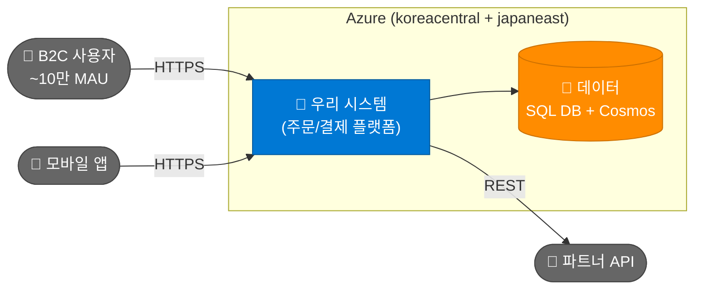
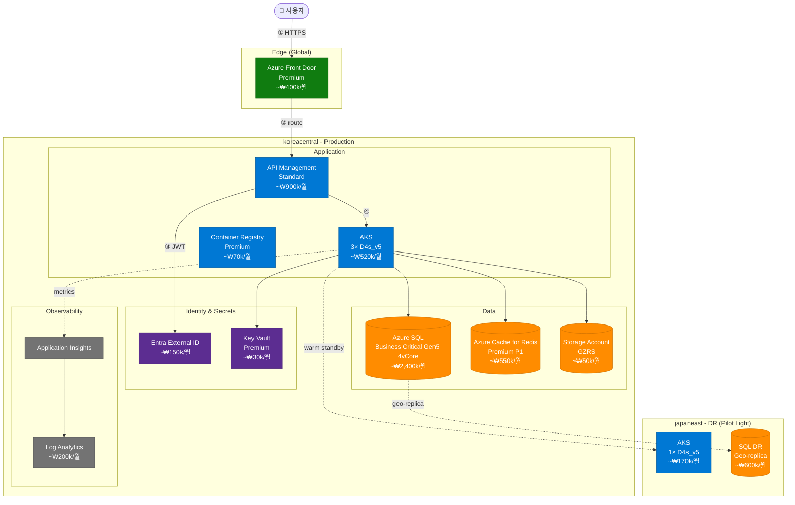
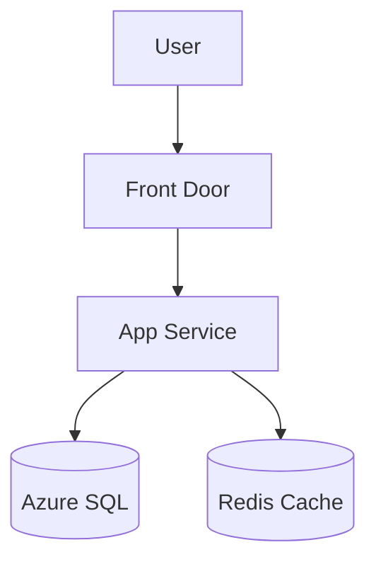
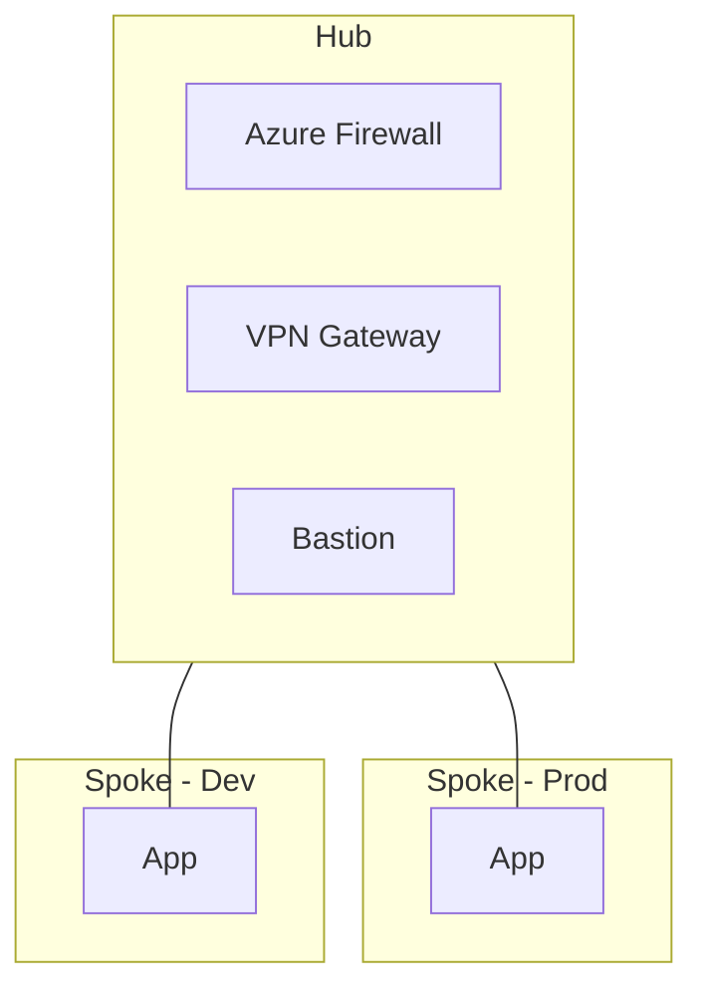
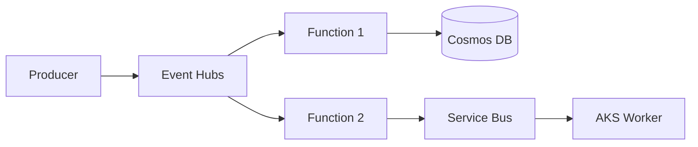
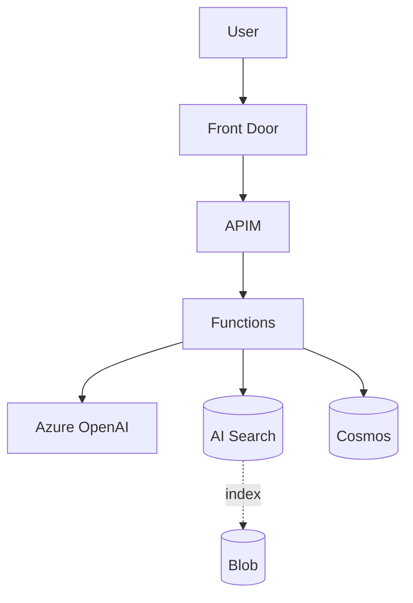

# Architecture Interview

사용자의 요구사항을 **구조화된 인터뷰**로 수집하고, 그 결과를 **의사결정용 산출물**로 변환합니다. 단순 다이어그램이 아니라 "이 결정을 왜 했는가"를 설명할 수 있는 ADR(Architecture Decision Record)을 함께 만드는 것이 목표입니다.

## 사용 시점
- 신규 워크로드 Azure 설계
- 기존 시스템 마이그레이션 청사진
- 후보 아키텍처 2-3개 비교 (의사결정 자료)
- 팀 합의용 다이어그램 작성
- ADR 문서 작성

복잡한 다단계 의사결정·WAF 깊은 검토는 `azure-architect` 에이전트로 위임. Bicep/Terraform 코드 생성은 각각 `bicep-generator`, `terraform-generator` 스킬로 위임.

## ⚠️ 안전 원칙

### 가짜 정보 금지
- 사용자가 답하지 않은 항목을 **추측으로 채우지 말 것**
- 모르는 항목은 "추가 조사 필요" 또는 "사용자 확인 필요"로 명시
- 비용 추정은 `mcp__azure__pricing` 결과만 사용, 어림짐작 금지

### 옵션 강요 금지
- 단일 정답을 제시하지 말 것 — 항상 2-3개 후보 + 명시적 trade-off
- 추천 표시(⭐)는 가능하지만 결정은 사용자에게

### 인터뷰 길이 자제
- 사용자 시간 존중 — 한 번에 모든 질문 X, 적응형 깊이
- "skip" / "기본값" / "나중에 결정" 옵션 항상 제공
- 5분 안에 1차 산출물이 나와야 함

## 워크플로우 (3-Phase)

### Phase 1: Triage (3분, 5–7개 질문)

목적: 후보 아키텍처 가지치기 (decision tree 상위 노드).

```
## 🎤 Phase 1: 빠른 트리아지 (5–7개 질문)

이 단계는 후보 아키텍처를 좁히기 위한 최소 질문입니다.
"잘 모르겠음" / "기본값" / "skip" 으로 답해도 됩니다.

1. **워크로드 종류**?
   - [ ] 웹/API (사용자 트래픽)
   - [ ] 배치/데이터 파이프라인
   - [ ] AI/LLM 애플리케이션
   - [ ] 이벤트 기반 (메시징·스트리밍)
   - [ ] 기타: ___

2. **사용자 규모**?
   - [ ] 사내 (~수백 명)
   - [ ] B2B (~수만 명)
   - [ ] B2C (~수십만+)
   - [ ] 모르겠음 → 중간 가정

3. **주 사용자 위치**?
   - [ ] 국내만
   - [ ] 국내 + 일본
   - [ ] 글로벌 (멀티 리전)

4. **기술 스택 선호**?
   - [ ] .NET / Java / Python / Node.js / Go / 기타: ___
   - [ ] 컨테이너 우선 / 서버리스 우선 / VM도 OK

5. **컴플라이언스 요구**?
   - [ ] 일반 / 개인정보보호법 / ISO 27001 / PCI-DSS / 금융권 / 기타

6. **예산 감각** (선택)?
   - [ ] 최소화 (~월 50만원)
   - [ ] 적정 (~월 500만원)
   - [ ] 안정성 우선 (예산 신경 안 씀)

7. **기존 Azure 자산** (선택)?
   - [ ] 신규 시작 / 기존 구독 활용 / 멀티 구독
```

답변 받은 뒤 **Phase 1 요약** 출력:

```
## 📋 트리아지 결과

| 항목 | 답변 |
|---|---|
| 워크로드 | B2C 웹 API |
| 규모 | ~10만 MAU |
| 위치 | 국내 + 일본 (DR) |
| 스택 | Java / Spring Boot, 컨테이너 선호 |
| 컴플라이언스 | 개인정보보호법 |
| 예산 | 적정 |

→ **후보 아키텍처 3개**: A) AKS 기반 / B) Container Apps 기반 / C) App Service 기반

Phase 2로 가시겠습니까? (하나의 후보를 선택하면 그것만 심화. "전부 비교"하면 셋 다 그립니다)
```

### Phase 2: Deep Dive (5–10분, 후보별 심화)

선택된 후보(들)에 대해 다음 카테고리를 질문:

#### A. 가용성 / 복원력
- RTO / RPO 목표 (시간/분/초 단위)
- 가용성 SLA (99.9% / 99.95% / 99.99%)
- 멀티 AZ / 멀티 리전 필요?
- 백업 보존 기간

#### B. 데이터
- 주 데이터 저장소 (관계형 vs NoSQL vs 둘 다)
- 데이터 양 (현재 / 1년 후)
- 트랜잭션 일관성 요구 강도
- 캐싱 / 검색 인덱스 필요?

#### C. 통합
- 기존 시스템 연동 (온프레미스, 다른 클라우드)
- 외부 API 의존성
- 메시징/이벤트 패턴

#### D. 보안 / Identity
- 사용자 인증 (Entra ID B2C / Auth0 / 자체)
- 비밀 관리 (Key Vault 사용 가정)
- 네트워크 격리 수준 (Private Endpoint 필수?)

#### E. 운영
- 모니터링 도구 선호 (Azure Monitor / Datadog / Grafana)
- IaC 도구 (Bicep / Terraform / 수동)
- CI/CD 파이프라인

각 항목마다 **현재까지 정해진 사항**을 표로 갱신해서 사용자에게 보여주기. 답변 패턴이 빠르면 한 번에 묶어서, 깊은 질문이면 하나씩.

### Phase 3: 산출물 (다이어그램 + ADR + 비용 + Terraform 권유)

다음 산출물을 **모두** 생성:

#### 산출물 1: 다층 다이어그램 (Mermaid 인라인 + D2 파일)

**두 형식 모두 생성**합니다:
- **Mermaid** — Claude Code 채팅에 인라인 미리보기 (즉시 검토)
- **D2** — `./diagrams/<adr-id>-<view>.d2` 파일로 저장 (의사결정·공유용 SVG 렌더)

D2를 쓰는 이유: 공식 Azure SVG 아이콘(`icons.terrastruct.com`) 임베드 가능, 단일 Go 바이너리, SVG 출력이 Confluence/Notion/GitHub에 그대로 임베드됨.

사용자가 D2 미설치여도 OK — `https://play.d2lang.com/` 에 텍스트 붙여넣어 즉시 렌더 가능.

**의사결정용으로 잘 그리기 위한 규칙**:

1. **다층 뷰 - 최소 2개, 권장 4개**:
   - **Context** (가장 외곽: 사용자·외부 시스템·우리 워크로드)
   - **Component** (논리 컴포넌트 + 책임 + 핵심 SKU)
   - **Network** (VNet·Subnet·Private Endpoint·NSG·Firewall)
   - **Data Flow** (request/response 또는 event 흐름의 번호 매긴 시퀀스)

2. **Azure 카테고리 색상 클래스** — 한눈에 카테고리 구분:

```mermaid
%%{init: {'theme':'default'}}%%
flowchart TB
    classDef compute fill:#0078D4,stroke:#005A9E,color:#fff
    classDef data fill:#FF8C00,stroke:#CC7000,color:#fff
    classDef network fill:#107C10,stroke:#0B5C0B,color:#fff
    classDef identity fill:#5C2D91,stroke:#4A2475,color:#fff
    classDef integration fill:#00BCF2,stroke:#0095BD,color:#fff
    classDef monitoring fill:#737373,stroke:#525252,color:#fff
    classDef ai fill:#E81123,stroke:#A80E1B,color:#fff
```

3. **각 노드에 SKU + 월 비용** 라벨:
   ```
   AKS["AKS<br/>3× D4s_v5<br/>~₩520k/월"]:::compute
   ```

4. **그룹화** — 리전·환경·티어로 subgraph:
   ```mermaid
   subgraph "koreacentral (Primary)"
     subgraph "Production"
       ...
     end
   end
   ```

5. **데이터 흐름은 번호 매기기**:
   ```
   User -->|① HTTPS| AFD
   AFD -->|② cached?| CDN
   AFD -->|③ origin| APIM
   ```

6. **여러 후보 비교 시** — 같은 viewport에 나란히 배치 후, 본문 표로 차이 정리.

**예시 — Context 뷰**:



**예시 — Component 뷰** (B2C 웹 API + AKS):



**D2 예시 (같은 다이어그램, 공식 Azure 아이콘 포함)**

`./diagrams/<adr-id>-component.d2` 로 저장:

```d2
vars: {
  d2-config: {
    theme-id: 200
    layout-engine: elk
  }
}

direction: down

user: "👤 사용자" { shape: person }

edge: "Edge (Global)" {
  afd: "Front Door\nPremium\n~₩400k/월" {
    icon: https://icons.terrastruct.com/azure%2FNetworking%2FAzure-Front-Door-Service.svg
  }
}

primary: "koreacentral - Production" {
  app: "Application" {
    apim: "API Management\nStandard\n~₩900k/월" {
      icon: https://icons.terrastruct.com/azure%2FApp%20Services%2FAPI-Management-Services.svg
    }
    aks: "AKS\n3× D4s_v5\n~₩520k/월" {
      icon: https://icons.terrastruct.com/azure%2FContainers%2FKubernetes-Services.svg
    }
    acr: "Container Registry\nPremium\n~₩70k/월" {
      icon: https://icons.terrastruct.com/azure%2FContainers%2FContainer-Registries.svg
    }
  }

  data: "Data" {
    sql: "Azure SQL\nBC Gen5 4vCore\n~₩2,400k/월" {
      icon: https://icons.terrastruct.com/azure%2FDatabases%2FSQL-Database.svg
      shape: cylinder
    }
    redis: "Redis\nPremium P1\n~₩550k/월" {
      icon: https://icons.terrastruct.com/azure%2FDatabases%2FCache-Redis.svg
      shape: cylinder
    }
    storage: "Storage\nGZRS\n~₩50k/월" {
      icon: https://icons.terrastruct.com/azure%2FStorage%2FStorage-Accounts.svg
      shape: cylinder
    }
  }

  identity: "Identity & Secrets" {
    entra: "Entra External ID\n~₩150k/월" {
      icon: https://icons.terrastruct.com/azure%2FIdentity%2FAzure-AD-B2C.svg
    }
    kv: "Key Vault\nPremium\n~₩30k/월" {
      icon: https://icons.terrastruct.com/azure%2FSecurity%2FKey-Vaults.svg
    }
  }

  obs: "Observability" {
    appi: "Application Insights" {
      icon: https://icons.terrastruct.com/azure%2FDevOps%2FApplication-Insights.svg
    }
    la: "Log Analytics\n~₩200k/월" {
      icon: https://icons.terrastruct.com/azure%2FAnalytics%2FLog-Analytics-Workspaces.svg
    }
  }
}

dr: "japaneast - DR (Pilot Light)" {
  aks_dr: "AKS\n1× D4s_v5\n~₩170k/월" {
    icon: https://icons.terrastruct.com/azure%2FContainers%2FKubernetes-Services.svg
  }
  sql_dr: "SQL DR\nGeo-replica\n~₩600k/월" {
    icon: https://icons.terrastruct.com/azure%2FDatabases%2FSQL-Database.svg
    shape: cylinder
  }
}

user -> edge.afd: "① HTTPS"
edge.afd -> primary.app.apim: "② route"
primary.app.apim -> primary.identity.entra: "③ JWT"
primary.app.apim -> primary.app.aks: "④"
primary.app.aks -> primary.data.redis
primary.app.aks -> primary.data.sql
primary.app.aks -> primary.data.storage
primary.app.aks -> primary.identity.kv
primary.app.aks -> primary.obs.appi: { style.stroke-dash: 3; label: "metrics" }
primary.obs.appi -> primary.obs.la
primary.data.sql -> dr.sql_dr: { style.stroke-dash: 3; label: "geo-replica" }
primary.app.aks -> dr.aks_dr: { style.stroke-dash: 3; label: "warm standby" }
```

**렌더 방법** — 사용자에게 알려줄 옵션:

```bash
# 옵션 1: 로컬에 D2 설치
brew install d2     # macOS
# 또는 https://d2lang.com/tour/install
d2 ./diagrams/<adr-id>-component.d2 ./diagrams/<adr-id>-component.svg

# 옵션 2: 온라인 (설치 없이)
# https://play.d2lang.com/ 에 .d2 파일 내용 붙여넣기 → 즉시 SVG 미리보기

# 옵션 3: VS Code 확장
# "D2" 확장 설치 → .d2 파일 열기 → 사이드바에서 실시간 미리보기
```

**파일 저장 시점** — 사용자가 ADR 검토 후 "OK" 했을 때 한 번에 저장:
```
./diagrams/<adr-id>-context.d2
./diagrams/<adr-id>-component.d2
./diagrams/<adr-id>-network.d2     (해당 시)
./diagrams/<adr-id>-dataflow.d2    (해당 시)
./diagrams/<adr-id>.md             (ADR + Mermaid 임베드)
```

#### 산출물 2: ADR (Architecture Decision Record)

```markdown
# ADR-001: B2C 주문 플랫폼 Azure 아키텍처

**Status**: Proposed
**Date**: 2026-04-26
**Deciders**: <팀명>
**Context Tags**: B2C, 한국+일본, 개인정보보호법, ~10만 MAU

## Context
[비즈니스 배경 1–2 문단]

## Decision
**선정 안**: B (Container Apps 기반)
**기각 안**: A (AKS — 운영 부담), C (App Service — 컨테이너 제약)

## Consequences
### 긍정
- 운영 부담 ↓ (서버리스 컨테이너)
- 콜드 스타트 < 1초 (Dapr 사이드카 활용 가능)
- 비용 ~30% ↓ vs AKS

### 부정
- AKS 대비 커스터마이징 한계
- Daemonset류 백그라운드 워크로드 어려움

## WAF 5축 평가
| 축 | 점수 | 코멘트 |
|---|---|---|
| Reliability | ⭐⭐⭐⭐ | 멀티 AZ + Geo-replica |
| Security | ⭐⭐⭐⭐⭐ | Private Endpoint + Managed Identity 전면 |
| Cost | ⭐⭐⭐⭐ | ~₩6.7M/월 (DR 포함) |
| Operations | ⭐⭐⭐⭐ | 서버리스로 운영 단순 |
| Performance | ⭐⭐⭐ | 콜드 스타트 가능성 — Always Ready 인스턴스 1로 완화 |

## 후보 안 비교
| 항목 | A: AKS | B: Container Apps ⭐ | C: App Service |
|---|---|---|---|
| 운영 복잡도 | 🔴 높음 | 🟢 낮음 | 🟢 매우 낮음 |
| 유연성 | 🟢 매우 높음 | 🟡 중간 | 🔴 낮음 |
| 월 비용(추정) | ₩9.2M | ₩6.7M | ₩4.5M |
| 컨테이너 지원 | ✅ | ✅ | ⚠️ 제한 |
| 추천 | | ⭐ | |

## 가정 (Assumptions)
- 사용자가 답하지 않은 항목은 "기본값" 표시:
  - RTO: 4시간 (가정)
  - RPO: 15분 (가정)
- 트래픽: peak 1000 RPS (가정 — 사용자 확인 필요)

## 다음 단계
1. 사용자 피드백 → ADR 확정
2. `terraform-generator` 스킬로 IaC 산출
3. `cost-analyzer`로 실시간 견적 검증
4. 단계별 배포 계획 (`azure-architect` 에이전트)
```

#### 산출물 3: 비용 추정

`mcp__azure__pricing` 활용해서 각 컴포넌트 SKU별 retail 가격 조회 → 한국 원화 환산 표.

```
## 💰 월 비용 추정 (Retail 기준, KRW)

| 컴포넌트 | SKU | 가격 단위 | 월 비용 |
|---|---|---|---|
| Front Door | Premium | $330 base + 처리량 | ~₩440k |
| API Management | Standard 1 unit | $700 | ~₩940k |
| Container Apps | 3× 1 vCPU/2 GB | per-second | ~₩280k |
| ACR | Premium | $50 + 트래픽 | ~₩70k |
| Azure SQL | Business Critical Gen5 4vCore | $1,800 | ~₩2,400k |
| Redis Premium P1 | $410 | | ~₩550k |
| Storage GZRS | 100 GB | $0.061/GB | ~₩9k |
| Key Vault Premium | per-operation | | ~₩30k |
| Log Analytics | 50 GB ingest | $2.76/GB | ~₩185k |
| **합계 (Primary)** | | | **~₩4,900k** |
| DR (japaneast pilot light) | | | **~₩1,800k** |
| **총합** | | | **~₩6,700k/월** |

⚠️ 추정치 — 실 트래픽·약정 할인(RI/Savings Plan)으로 ±20% 변동 가능
```

#### 산출물 4: 다음 단계 안내

```
## 🎯 다음 단계 추천

1. **검토** — 위 ADR 검토 후 수정 요청
2. **IaC 생성** — "이 아키텍처로 Terraform 짜줘" → `terraform-generator` 스킬
3. **비용 검증** — `cost-analyzer` 스킬에서 약정 할인 시뮬레이션
4. **거버넌스** — `governance-check` 스킬에서 네이밍·태그 규칙 사전 검증
5. **단계별 배포** — `azure-architect` 에이전트에 단계별 마이그레이션 계획 위임
```

## Diagram 품질 체크리스트

산출 직전 다음 모두 확인:

**공통**
- [ ] 최소 2개 뷰 (Context + Component)
- [ ] 모든 노드에 SKU 또는 비용 라벨
- [ ] subgraph(Mermaid) / nested container(D2)로 리전·티어 그룹화
- [ ] 데이터 흐름에 번호 매김 (① ② ③)
- [ ] 후보가 2개 이상이면 비교 표 첨부

**Mermaid (인라인)**
- [ ] 카테고리 색상 클래스 적용
- [ ] 문법 검증 (특수문자 escape — `(`, `)` 등은 따옴표로 감싸기)
- [ ] 라인 길이 80자 이내 권장 (가독성)

**D2 (산출물)**
- [ ] 모든 Azure 리소스에 `icon: https://icons.terrastruct.com/azure%2F...` 첨부
- [ ] `theme-id: 200` (또는 사용자 선호 테마) 설정
- [ ] `layout-engine: elk` (무료, 가장 깔끔) 또는 `dagre`
- [ ] 파일 저장 경로: `./diagrams/<adr-id>-<view>.d2`
- [ ] 사용자에게 렌더 방법 안내(local d2 / play.d2lang.com / VS Code 확장)

## Snippet 라이브러리 (Mermaid + D2 병기)

자주 쓰는 패턴 모음. 각 패턴마다 Mermaid(인라인용)와 D2(산출물용) 두 형식.

### 단일 리전 웹 + DB

**Mermaid**


**D2**
```d2
user -> afd
afd: Front Door { icon: https://icons.terrastruct.com/azure%2FNetworking%2FAzure-Front-Door-Service.svg }
app: App Service { icon: https://icons.terrastruct.com/azure%2FApp%20Services%2FApp-Services.svg }
sql: SQL { shape: cylinder; icon: https://icons.terrastruct.com/azure%2FDatabases%2FSQL-Database.svg }
redis: Redis { shape: cylinder; icon: https://icons.terrastruct.com/azure%2FDatabases%2FCache-Redis.svg }
afd -> app -> sql
app -> redis
```

### Hub-Spoke 네트워크

**Mermaid**


**D2**
```d2
hub: Hub VNet {
  fw: Azure Firewall { icon: https://icons.terrastruct.com/azure%2FNetworking%2FFirewalls.svg }
  vpn: VPN Gateway { icon: https://icons.terrastruct.com/azure%2FNetworking%2FVirtual-Network-Gateways.svg }
  bastion: Bastion { icon: https://icons.terrastruct.com/azure%2FNetworking%2FBastions.svg }
}
spoke_prod: Spoke - Prod {
  app: App
}
spoke_dev: Spoke - Dev {
  app: App
}
hub <-> spoke_prod: peering
hub <-> spoke_dev: peering
```

### 이벤트 기반

**Mermaid**


**D2**
```d2
producer -> eh
eh: Event Hubs { icon: https://icons.terrastruct.com/azure%2FAnalytics%2FEvent-Hubs.svg }
fn1: Function 1 { icon: https://icons.terrastruct.com/azure%2FCompute%2FFunction-Apps.svg }
fn2: Function 2 { icon: https://icons.terrastruct.com/azure%2FCompute%2FFunction-Apps.svg }
cosmos: Cosmos DB { shape: cylinder; icon: https://icons.terrastruct.com/azure%2FDatabases%2FAzure-Cosmos-DB.svg }
sb: Service Bus { icon: https://icons.terrastruct.com/azure%2FIntegration%2FService-Bus.svg }
worker: AKS Worker { icon: https://icons.terrastruct.com/azure%2FContainers%2FKubernetes-Services.svg }

eh -> fn1 -> cosmos
eh -> fn2 -> sb -> worker
```

### AI/LLM 애플리케이션

**Mermaid**


**D2**
```d2
user -> afd
afd: Front Door { icon: https://icons.terrastruct.com/azure%2FNetworking%2FAzure-Front-Door-Service.svg }
apim: APIM { icon: https://icons.terrastruct.com/azure%2FApp%20Services%2FAPI-Management-Services.svg }
fn: Functions { icon: https://icons.terrastruct.com/azure%2FCompute%2FFunction-Apps.svg }
aoai: Azure OpenAI { icon: https://icons.terrastruct.com/azure%2FAI%20%2B%20Machine%20Learning%2FCognitive-Services.svg }
search: AI Search { shape: cylinder; icon: https://icons.terrastruct.com/azure%2FDatabases%2FAzure-Cognitive-Search.svg }
cosmos: Cosmos { shape: cylinder; icon: https://icons.terrastruct.com/azure%2FDatabases%2FAzure-Cosmos-DB.svg }
storage: Blob { shape: cylinder; icon: https://icons.terrastruct.com/azure%2FStorage%2FStorage-Accounts.svg }

afd -> apim -> fn
fn -> aoai
fn -> search
fn -> cosmos
search -> storage: { style.stroke-dash: 3; label: "index" }
```

### D2 아이콘 URL 패턴 빠른 참고

```
https://icons.terrastruct.com/azure%2F<카테고리>%2F<서비스명>.svg

카테고리 예시 (URL-encode 필요):
- Compute              → Compute
- Containers           → Containers
- Networking           → Networking
- Storage              → Storage
- Databases            → Databases
- App Services         → App%20Services
- AI + Machine Learning → AI%20%2B%20Machine%20Learning
- Identity             → Identity
- Security             → Security
- Integration          → Integration
- Analytics            → Analytics
- DevOps               → DevOps
- General              → General

서비스명은 dash로 (Storage-Accounts, Function-Apps, Kubernetes-Services 등).
정확한 URL 모르면: https://icons.terrastruct.com 에서 검색 가능.
```

## 다른 컴포넌트로 위임
- 복잡한 다단계 결정·WAF 깊은 검토 → `azure-architect` 에이전트
- Bicep 코드 생성 → `bicep-generator` 스킬
- Terraform 코드 생성 → `terraform-generator` 스킬
- 비용 약정 시뮬레이션 → `cost-analyzer` 스킬
- 네이밍·태그 사전 검증 → `governance-check` 스킬

## 인터뷰 진행 팁

### 사용자가 모를 때
"잘 모르겠다"는 답이 가장 흔함. 다음 패턴으로 응대:
- 기본값 제시 + 그 결정의 영향 명시 ("RTO 4시간으로 잡으면 비용 -30%, RPO 1시간으로 늘리면 -10%")
- 유사 사례 비교 ("비슷한 규모의 B2C는 보통 99.95% SLA로 가는 편")

### 답이 모순될 때
"99.99% SLA + 예산 최소화" 같은 모순은 **즉시 명시적으로 지적**:
> 99.99% SLA는 멀티 AZ + 멀티 리전이 필수라 월 1천만원 이상이 일반적입니다. 예산 우선이면 99.9% (월 5–7백만원)로 낮추거나, SLA 우선이면 예산 재검토가 필요합니다. 어느 쪽 우선시할까요?

### 비기술 사용자
- 서비스명 영문 + 한국어 설명 ("AKS — 컨테이너 자동 운영 플랫폼")
- 비용은 절대값보다 비교 ("A안은 B안 대비 +30%")

## 참고 자료
- Azure Architecture Center: https://learn.microsoft.com/azure/architecture/
- Reference Architectures: https://learn.microsoft.com/azure/architecture/browse/
- Mermaid 문법: https://mermaid.js.org/syntax/flowchart.html
- ADR 템플릿: https://adr.github.io/
