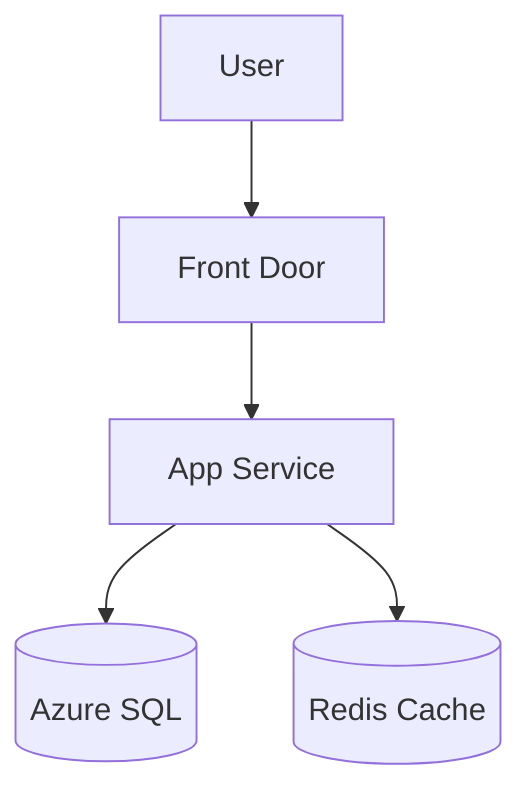
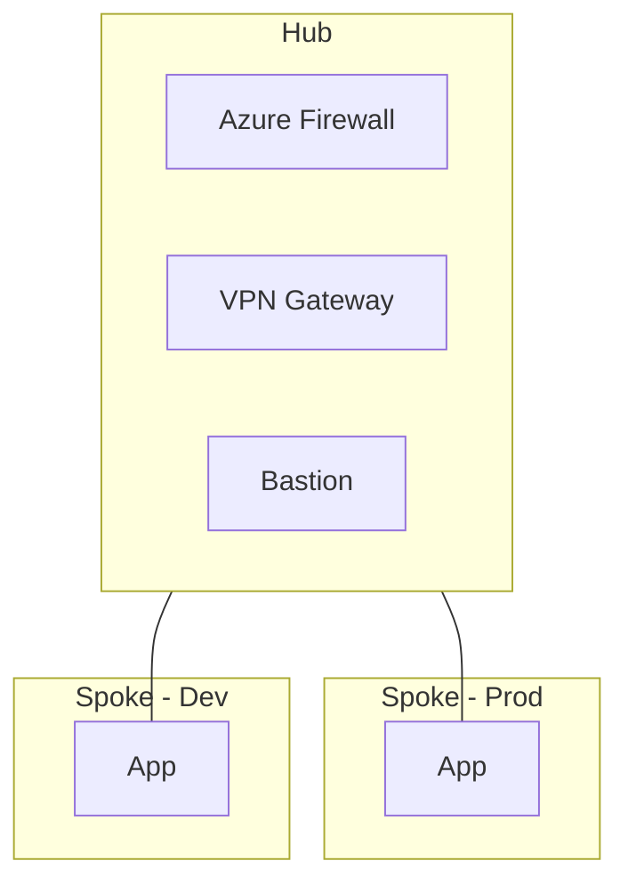
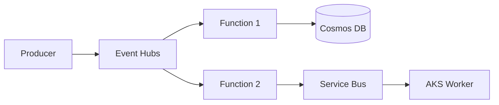
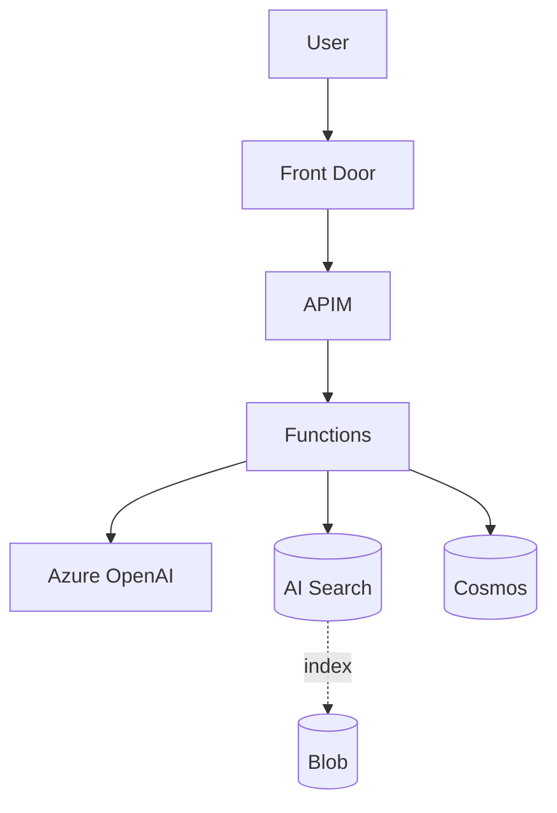

# Architecture Interview

사용자의 요구사항을 **구조화된 인터뷰**로 수집하고, 그 결과를 **의사결정용 산출물**로 변환합니다. 단순 다이어그램이 아니라 "이 결정을 왜 했는가"를 설명할 수 있는 ADR(Architecture Decision Record)을 함께 만드는 것이 목표입니다.

## 사용 시점
- 신규 워크로드 Azure 설계
- 기존 시스템 마이그레이션 청사진
- 후보 아키텍처 2-3개 비교 (의사결정 자료)
- 팀 합의용 다이어그램 작성
- ADR 문서 작성

복잡한 다단계 의사결정·WAF 깊은 검토는 `azure-architect` 에이전트로 위임. Bicep/Terraform 코드 생성은 각각 `bicep-generator`, `terraform-generator` 스킬로 위임.

## ⚠️ 안전 원칙

### 가짜 정보 금지
- 사용자가 답하지 않은 항목을 **추측으로 채우지 말 것**
- 모르는 항목은 "추가 조사 필요" 또는 "사용자 확인 필요"로 명시
- 비용 추정은 `mcp__azure__pricing` 결과만 사용, 어림짐작 금지

### 옵션 강요 금지
- 단일 정답을 제시하지 말 것 — 항상 2-3개 후보 + 명시적 trade-off
- 추천 표시(⭐)는 가능하지만 결정은 사용자에게

### 인터뷰 길이 자제
- 사용자 시간 존중 — 한 번에 모든 질문 X, 적응형 깊이
- "skip" / "기본값" / "나중에 결정" 옵션 항상 제공
- 5분 안에 1차 산출물이 나와야 함

## 워크플로우 (3-Phase)

### Phase 1: Triage (3분, 5–7개 질문)

목적: 후보 아키텍처 가지치기 (decision tree 상위 노드).

```
## 🎤 Phase 1: 빠른 트리아지 (5–7개 질문)

이 단계는 후보 아키텍처를 좁히기 위한 최소 질문입니다.
"잘 모르겠음" / "기본값" / "skip" 으로 답해도 됩니다.

1. **워크로드 종류**?
   - [ ] 웹/API (사용자 트래픽)
   - [ ] 배치/데이터 파이프라인
   - [ ] AI/LLM 애플리케이션
   - [ ] 이벤트 기반 (메시징·스트리밍)
   - [ ] 기타: ___

2. **사용자 규모**?
   - [ ] 사내 (~수백 명)
   - [ ] B2B (~수만 명)
   - [ ] B2C (~수십만+)
   - [ ] 모르겠음 → 중간 가정

3. **주 사용자 위치**?
   - [ ] 국내만
   - [ ] 국내 + 일본
   - [ ] 글로벌 (멀티 리전)

4. **기술 스택 선호**?
   - [ ] .NET / Java / Python / Node.js / Go / 기타: ___
   - [ ] 컨테이너 우선 / 서버리스 우선 / VM도 OK

5. **컴플라이언스 요구**?
   - [ ] 일반 / 개인정보보호법 / ISO 27001 / PCI-DSS / 금융권 / 기타

6. **예산 감각** (선택)?
   - [ ] 최소화 (~월 50만원)
   - [ ] 적정 (~월 500만원)
   - [ ] 안정성 우선 (예산 신경 안 씀)

7. **기존 Azure 자산** (선택)?
   - [ ] 신규 시작 / 기존 구독 활용 / 멀티 구독
```

답변 받은 뒤 **Phase 1 요약** 출력:

```
## 📋 트리아지 결과

| 항목 | 답변 |
|---|---|
| 워크로드 | B2C 웹 API |
| 규모 | ~10만 MAU |
| 위치 | 국내 + 일본 (DR) |
| 스택 | Java / Spring Boot, 컨테이너 선호 |
| 컴플라이언스 | 개인정보보호법 |
| 예산 | 적정 |

→ **후보 아키텍처 3개**: A) AKS 기반 / B) Container Apps 기반 / C) App Service 기반

Phase 2로 가시겠습니까? (하나의 후보를 선택하면 그것만 심화. "전부 비교"하면 셋 다 그립니다)
```

### Phase 2: Deep Dive (5–10분, 후보별 심화)

선택된 후보(들)에 대해 다음 카테고리를 질문:

#### A. 가용성 / 복원력
- RTO / RPO 목표 (시간/분/초 단위)
- 가용성 SLA (99.9% / 99.95% / 99.99%)
- 멀티 AZ / 멀티 리전 필요?
- 백업 보존 기간

#### B. 데이터
- 주 데이터 저장소 (관계형 vs NoSQL vs 둘 다)
- 데이터 양 (현재 / 1년 후)
- 트랜잭션 일관성 요구 강도
- 캐싱 / 검색 인덱스 필요?

#### C. 통합
- 기존 시스템 연동 (온프레미스, 다른 클라우드)
- 외부 API 의존성
- 메시징/이벤트 패턴

#### D. 보안 / Identity
- 사용자 인증 (Entra ID B2C / Auth0 / 자체)
- 비밀 관리 (Key Vault 사용 가정)
- 네트워크 격리 수준 (Private Endpoint 필수?)

#### E. 운영
- 모니터링 도구 선호 (Azure Monitor / Datadog / Grafana)
- IaC 도구 (Bicep / Terraform / 수동)
- CI/CD 파이프라인

각 항목마다 **현재까지 정해진 사항**을 표로 갱신해서 사용자에게 보여주기. 답변 패턴이 빠르면 한 번에 묶어서, 깊은 질문이면 하나씩.

### Phase 3: 산출물 (다이어그램 + ADR + 비용 + Terraform 권유)

다음 산출물을 **모두** 생성:

#### 산출물 1: 다층 다이어그램 (Mermaid 인라인 + Drawpyo Python → drawio)

**두 산출물을 동시 생성**합니다 (각 뷰마다):

1. **Mermaid 코드블록** — Claude Code 채팅에 인라인 미리보기 (즉시 검토용, 추상적 흐름 확인)
2. **Drawpyo Python 스크립트** — `./diagrams/<adr-id>-<view>.py` 로 저장한 뒤 **스킬이 자동으로 `python3` 으로 실행**해서 `<name>.drawio` 까지 만들어 둡니다. 사용자는 drawio.com / drawio Desktop / VS Code drawio 확장에서 `.drawio` 만 열어서 **MS 공식 Azure 아이콘**으로 PNG/SVG로 렌더 — **MS Learn 스타일 의사결정 자료 품질**.

**왜 Drawpyo + drawio + benc-uk SVG?**
- **MS 공식 Azure 아이콘 SVG** 를 image-based shape로 직접 임베드 (`benc-uk/icon-collection`은 learn.microsoft.com 공식 셋의 raw GitHub 미러) → drawio 어떤 빌드든 동일하게 렌더, MS Learn 시각적 등가
- Drawpyo가 좌표·스타일·XML 디테일을 캡슐화 → LLM이 좌표 잡으면 결과 들쭉날쭉한 문제 회피
- 엣지는 `orthogonalEdgeStyle` 직각 라우팅 + 둥근 모서리 → MS Learn 특유의 깔끔한 선
- 결과물(`.drawio`)은 사용자가 추가 편집 가능 (drawio에서 자유롭게 수정/공유)
- SVG/PNG export → Confluence/Notion/GitHub Issue/PR 본문에 그대로 임베드

> **v0.7.1 → v0.7.2 변경**: v0.7.1까지 `shape=mxgraph.azure2.<kind>` 를 시도했으나 drawio 현재 빌드에 그 이름이 없어 빈 박스로 렌더 + 기본 polyline 엣지가 노드 사이 직선으로 가로질러 난잡 → 이번 버전에서 image-based shape (benc-uk SVG) + orthogonal 엣지 기본값으로 전환.

**폴백: D2** — 사용자가 Python 환경 못 쓰는 경우 D2 텍스트 파일도 함께 제공 (이 문서 하단의 "D2 폴백" 절 참조).

**의사결정용으로 잘 그리기 위한 규칙**:

1. **다층 뷰 - 최소 2개, 권장 4개**:
   - **Context** (가장 외곽: 사용자·외부 시스템·우리 워크로드)
   - **Component** (논리 컴포넌트 + 책임 + 핵심 SKU)
   - **Network** (VNet·Subnet·Private Endpoint·NSG·Firewall)
   - **Data Flow** (request/response 또는 event 흐름의 번호 매긴 시퀀스)

2. **Azure 카테고리 색상 클래스** — 한눈에 카테고리 구분:

```mermaid
%%{init: {'theme':'default'}}%%
flowchart TB
    classDef compute fill:#0078D4,stroke:#005A9E,color:#fff
    classDef data fill:#FF8C00,stroke:#CC7000,color:#fff
    classDef network fill:#107C10,stroke:#0B5C0B,color:#fff
    classDef identity fill:#5C2D91,stroke:#4A2475,color:#fff
    classDef integration fill:#00BCF2,stroke:#0095BD,color:#fff
    classDef monitoring fill:#737373,stroke:#525252,color:#fff
    classDef ai fill:#E81123,stroke:#A80E1B,color:#fff
```

3. **각 노드에 SKU + 월 비용** 라벨:
   ```
   AKS["AKS<br/>3× D4s_v5<br/>~₩520k/월"]:::compute
   ```

4. **그룹화** — 리전·환경·티어로 subgraph:
   ```mermaid
   subgraph "koreacentral (Primary)"
     subgraph "Production"
       ...
     end
   end
   ```

5. **데이터 흐름은 번호 매기기**:
   ```
   User -->|① HTTPS| AFD
   AFD -->|② cached?| CDN
   AFD -->|③ origin| APIM
   ```

6. **여러 후보 비교 시** — 같은 viewport에 나란히 배치 후, 본문 표로 차이 정리.

**예시 — Context 뷰**:


**예시 — Component 뷰** (B2C 웹 API + AKS):


**Drawpyo Python 스크립트 — 의사결정용 (MS Learn 스타일 산출물)**

스킬은 다음과 같은 self-contained Python 스크립트를 `./diagrams/<adr-id>-component.py` 로 생성한 다음, **스킬이 직접 `python3`으로 실행**해서 `.drawio` 파일까지 만들어 둡니다 (자동 실행 절차는 본 문서의 "산출물 1-A: 자동 실행" 절 참조). 사용자는 drawio에서 `.drawio` 열어 PNG/SVG export 만 하면 됩니다.

```python
#!/usr/bin/env python3
"""
Architecture diagram (Component view) for ADR-001: B2C Order Platform
Generated by claude-code architecture-interview skill.

Usage (스킬이 자동 실행하므로 보통 사용자가 직접 칠 일은 없음):
    pip3 install drawpyo                                # 1회만 (macOS 기본 'python3'/'pip3')
    python3 diagrams/ADR-001-component.py
    # → diagrams/ADR-001-component.drawio 생성
    # → drawio.com 또는 VS Code drawio 확장에서 열어 PNG/SVG export
"""
import os
import drawpyo

# ───────────────────── Helpers ─────────────────────

# Azure shape style. **MS 공식 Azure 아이콘 SVG**(`benc-uk/icon-collection`,
# learn.microsoft.com 공식 셋의 raw 미러)를 image-based shape로 임베드.
# v0.7.1까지 'shape=mxgraph.azure2.*' 사용했으나 drawio 현재 빌드에 그 이름이
# 없어 빈 박스로 렌더 → v0.7.2부터 외부 SVG URL 직접 참조로 전환.
ICONS_BASE = "https://raw.githubusercontent.com/benc-uk/icon-collection/master/azure-icons"

# kind → benc-uk repo 안의 정확한 파일명 (확장자 제외)
# 모르면 ICONS_BASE 디렉토리 https://github.com/benc-uk/icon-collection/tree/master/azure-icons 에서 검색.
AZURE_ICON = {
    # Compute
    "vm":              "Virtual-Machine",
    "vmss":            "VM-Scale-Sets",
    "app_service":     "App-Services",
    "function":        "Function-Apps",
    # Containers
    "aks":             "Kubernetes-Services",
    "container_apps":  "Container-Instances",
    "acr":             "Container-Registries",
    # Networking
    "front_door":      "Front-Doors",
    "app_gateway":     "Application-Gateways",
    "load_balancer":   "Load-Balancers",
    "vnet":            "Virtual-Networks",
    "vpn_gateway":     "Virtual-Network-Gateways",
    "firewall":        "Firewalls",
    "nsg":             "Network-Security-Groups",
    "public_ip":       "Public-IP-Addresses",
    # App Services
    "apim":            "API-Management-Services",
    # Databases
    "sql":             "SQL-Database",
    "cosmos":          "Azure-Cosmos-DB",
    "postgres":        "Azure-Database-PostgreSQL-Server",
    "mysql":           "Azure-Database-MySQL-Server",
    "redis":           "Cache-Redis",
    # Storage
    "storage":         "Storage-Accounts",
    "disk":            "Disks",
    # Identity & Security
    "entra":           "Azure-Active-Directory",
    "entra_b2c":       "Azure-AD-B2C",
    "kv":              "Key-Vaults",
    "sentinel":        "Azure-Sentinel",
    # Integration / Messaging
    "service_bus":     "Service-Bus",
    "event_hubs":      "Event-Hubs",
    # Analytics / Monitoring
    "appi":            "Application-Insights",
    "log_analytics":   "Log-Analytics-Workspaces",
    "synapse":         "Azure-Synapse-Analytics",
    "advisor":         "Advisor",
    # AI/ML  (benc-uk에 OpenAI 단독 아이콘 없음 → Cognitive-Services 사용)
    "openai":          "Cognitive-Services",
    "cognitive":       "Cognitive-Services",
    "ai_search":       "Search-Services",
    # Generic
    "user":            None,   # SVG 미사용, 기본 person shape
    "internet":        None,
    "subscription":    "Subscriptions",
    "resource_group":  "Resource-Groups",
}

# 외부 image URL을 image-based drawio shape로 사용. aspect=fixed 로 비율 유지.
ICON_STYLE = (
    "sketch=0;outlineConnect=0;fontColor=#23272F;fontSize=11;"
    "verticalLabelPosition=bottom;verticalAlign=top;align=center;html=1;"
    "aspect=fixed;shape=image;image={url};imageBackground=none;"
)

# v0.7.1 잔재: mxgraph.azure2 시도시 빈 박스 → 더 이상 사용 X
# (참고만; 코드에서 호출되지 않음)
_AZ_BASE_DEPRECATED = "shape=mxgraph.azure2.{kind};fillColor=#FFFFFF"

def azure_shape(kind: str) -> str:
    """Return image-based drawio style for an Azure service icon (MS 공식 SVG)."""
    fname = AZURE_ICON.get(kind)
    if fname is None:
        # user / internet 등 — 기본 도형으로 fallback
        if kind == "user":
            return ("shape=mxgraph.bootstrap.user;fillColor=#5C2D91;strokeColor=none;"
                    "fontColor=#FFFFFF;html=1;align=center;verticalAlign=middle;")
        if kind == "internet":
            return ("ellipse;whiteSpace=wrap;html=1;fillColor=#E8EAED;strokeColor=#5F6368;"
                    "fontColor=#202124;")
        return f"rounded=1;whiteSpace=wrap;html=1;fillColor=#FFFFFF;strokeColor=#7A869A;"
    return ICON_STYLE.format(url=f"{ICONS_BASE}/{fname}.svg")

def add_node(page, value, kind, x, y, w=64, h=64):
    """Add an Azure resource node with the official MS Azure SVG icon."""
    o = drawpyo.diagram.Object(page=page, value=value)
    o.apply_style_string(azure_shape(kind))
    o.position = (x, y)
    o.geometry.width = w
    o.geometry.height = h
    return o

def add_group(page, value, x, y, w, h, fill="#F5F7FA", stroke="#7A869A"):
    """Add a transparent grouping container (region/tier/subnet box)."""
    g = drawpyo.diagram.Object(page=page, value=value)
    g.apply_style_string(
        f"rounded=1;whiteSpace=wrap;html=1;fillColor={fill};strokeColor={stroke};"
        f"dashed=1;verticalAlign=top;fontSize=13;fontStyle=1;align=left;"
        f"spacingLeft=10;spacingTop=4;"
    )
    g.position = (x, y)
    g.geometry.width = w
    g.geometry.height = h
    return g

# MS Learn 스타일 직각(Manhattan) 라우팅. 노드 간 자동 경로, 모서리 둥글게.
# v0.7.1까지 polyline 기본값으로 선이 난잡하게 가로지르는 문제 → orthogonal로 전환.
ORTHOGONAL_EDGE = (
    "edgeStyle=orthogonalEdgeStyle;rounded=1;orthogonalLoop=1;jettySize=auto;"
    "html=1;exitX=0.5;exitY=1;exitDx=0;exitDy=0;entryX=0.5;entryY=0;entryDx=0;entryDy=0;"
    "endArrow=block;endFill=1;strokeColor=#5F6368;fontColor=#23272F;fontSize=10;"
)

# 점선 (비동기·복제 같은 logical 연결용)
ORTHOGONAL_EDGE_DASHED = ORTHOGONAL_EDGE + "dashed=1;"

def add_edge(page, src, tgt, label="", style=None):
    """Add an orthogonal arrow edge between two nodes (MS Learn-style routing)."""
    e = drawpyo.diagram.Edge(page=page, source=src, target=tgt, value=label)
    e.apply_style_string(style or ORTHOGONAL_EDGE)
    return e

# ───────────────────── Auto-layout (Cluster) ─────────────────────
# v0.7.3 추가. v0.7.2까지 수동 좌표 계산으로 라벨 잘림·박스 겹침·노드 외톨이 발생.
# Cluster/Row 추상화로 LLM은 구조만 선언, 좌표는 자동 계산.

NODE_W_MIN     = 96     # 최소 노드 width (한국어 라벨 잘림 방지)
NODE_H         = 64     # 노드 height (icon 영역)
NODE_LABEL_PAD = 48     # 노드 아래 라벨 영역 (3줄까지 안전)
NODE_GAP_X     = 32     # 같은 row 안 노드 가로 간격
ROW_GAP        = 24     # row 사이 세로 간격
PAD            = 24     # cluster 내부 여백
TITLE_BAR      = 32     # 그룹 제목 영역

def estimate_label_width(label: str, font_size: int = 11) -> int:
    """한국어/영문 혼합 라벨의 픽셀 width 추정 (가장 긴 줄 기준)."""
    def line_w(line: str) -> float:
        w = 0.0
        for ch in line:
            if '가' <= ch <= '힣' or 'ㄱ' <= ch <= 'ㆎ':
                w += font_size           # 한글 한 글자 ≈ font_size
            elif ch == ' ':
                w += font_size * 0.4
            else:
                w += font_size * 0.62    # 영문/숫자/기호
        return w
    longest = max((line_w(l) for l in label.split("\n")), default=font_size * 4)
    return max(int(longest) + 16, NODE_W_MIN)

class Row:
    """Cluster 내부 가로 행. Cluster.row()로 생성."""
    def __init__(self, name, fill="#FFFFFF", stroke="#0078D4"):
        self.name = name
        self.fill = fill
        self.stroke = stroke
        self.items = []   # list of dicts: {label, kind, id, w, h}

    def add(self, label, kind, id=None, w=None, h=None):
        """Add a node. width auto from label if not given."""
        self.items.append({
            "label": label,
            "kind":  kind,
            "id":    id or f"{kind}_{len(self.items)}",
            "w":     w or estimate_label_width(label),
            "h":     h or NODE_H,
        })
        return self

    def _size(self):
        if not self.items:
            return 120, NODE_H + NODE_LABEL_PAD + TITLE_BAR
        total_w = sum(n["w"] for n in self.items) \
                  + NODE_GAP_X * (len(self.items) - 1) \
                  + PAD * 2
        max_h = max(n["h"] for n in self.items)
        return total_w, max_h + NODE_LABEL_PAD + TITLE_BAR

class Cluster:
    """
    의사결정용 자동 레이아웃 컨테이너. 사용 흐름:
        c = Cluster("koreacentral — Production", fill="#EAF2FB")
        app = c.row("Application", stroke="#0078D4")
        app.add("APIM\\nStandard\\n~₩900k/월", "apim", id="apim")
        app.add("AKS\\n3× D4s_v5\\n~₩520k/월", "aks", id="aks")
        ...
        nodes = c.layout(page, x=40, y=40)
        add_edge(page, nodes["apim"], nodes["aks"])
    """
    GROUP_STYLE = (
        "rounded=1;whiteSpace=wrap;html=1;fillColor={fill};strokeColor={stroke};"
        "dashed=1;verticalAlign=top;align=left;spacingLeft=10;spacingTop=4;"
        "fontStyle=1;fontSize={fs};"
    )

    def __init__(self, name, fill="#F5F7FA", stroke="#7A869A"):
        self.name = name
        self.fill = fill
        self.stroke = stroke
        self.rows = []
        self.bbox = None   # (x, y, w, h) after layout()

    def row(self, name, fill="#FFFFFF", stroke="#0078D4"):
        r = Row(name, fill=fill, stroke=stroke)
        self.rows.append(r)
        return r

    def layout(self, page, x=40, y=40):
        """좌표 자동 계산 + drawio Object 생성. Returns dict {id: Object}."""
        # Phase 1: row 사이즈 계산 → cluster bbox 결정
        row_geo = []
        max_inner_w = 0
        cur_y = y + TITLE_BAR + PAD
        for r in self.rows:
            rw, rh = r._size()
            row_geo.append((r, x + PAD, cur_y, rw, rh))
            max_inner_w = max(max_inner_w, rw)
            cur_y += rh + ROW_GAP
        cluster_w = max_inner_w + PAD * 2
        cluster_h = (cur_y - ROW_GAP) - y + PAD
        self.bbox = (x, y, cluster_w, cluster_h)

        # Phase 2: outer cluster box (z-order 가장 아래)
        outer = drawpyo.diagram.Object(page=page, value=self.name)
        outer.apply_style_string(self.GROUP_STYLE.format(
            fill=self.fill, stroke=self.stroke, fs=14))
        outer.position = (x, y)
        outer.geometry.width = cluster_w
        outer.geometry.height = cluster_h

        # Phase 3: row 박스 (중간 z-order)
        for r, rx, ry, rw, rh in row_geo:
            row_box = drawpyo.diagram.Object(page=page, value=r.name)
            row_box.apply_style_string(self.GROUP_STYLE.format(
                fill=r.fill, stroke=r.stroke, fs=12))
            row_box.position = (rx, ry)
            row_box.geometry.width = rw
            row_box.geometry.height = rh

        # Phase 4: 노드 (가장 위 z-order)
        nodes = {}
        for r, rx, ry, rw, rh in row_geo:
            child_y = ry + TITLE_BAR
            child_x = rx + PAD
            for n in r.items:
                obj = drawpyo.diagram.Object(page=page, value=n["label"])
                obj.apply_style_string(azure_shape(n["kind"]))
                obj.position = (child_x, child_y)
                obj.geometry.width = n["w"]
                obj.geometry.height = n["h"]
                nodes[n["id"]] = obj
                child_x += n["w"] + NODE_GAP_X
        return nodes

# ───────────────────── File ─────────────────────

OUT_DIR = os.path.dirname(os.path.abspath(__file__))
ADR_ID = "ADR-001"
VIEW = "component"

f = drawpyo.File()
f.file_path = OUT_DIR
f.file_name = f"{ADR_ID}-{VIEW}.drawio"

page = drawpyo.Page(file=f, name=f"{ADR_ID} — Component View")

# ───────────────────── Layout (Cluster auto-layout) ─────────────────────
# LLM은 "구조"만 선언. 좌표·박스 크기·라벨 width 모두 Cluster.layout()이 계산.

# 사용자(외톨이 노드)
user = add_node(page, "B2C 사용자\n~10만 MAU", "user", x=40, y=120, w=120, h=72)

# Edge (Global) — 단일 노드라 Cluster까진 안 가도 OK
edge = Cluster("Edge (Global)", fill="#FFFFFF")
edge.row("CDN", stroke="#107C10").add(
    "Front Door\nPremium\n~₩400k/월", "front_door", id="afd")
edge_nodes = edge.layout(page, x=200, y=80)

# koreacentral — Production (4개 row 자동 레이아웃)
prod = Cluster("koreacentral — Production", fill="#EAF2FB", stroke="#0078D4")

app = prod.row("Application", stroke="#0078D4")
app.add("APIM\nStandard\n~₩900k/월", "apim", id="apim")
app.add("AKS\n3× D4s_v5\n~₩520k/월", "aks",  id="aks")
app.add("ACR\nPremium\n~₩70k/월",    "acr",  id="acr")

data = prod.row("Data", stroke="#FF8C00")
data.add("Azure SQL\nBC Gen5 4vCore\n~₩2,400k/월", "sql",     id="sql")
data.add("Redis\nPremium P1\n~₩550k/월",            "redis",   id="redis")
data.add("Storage\nGZRS\n~₩50k/월",                  "storage", id="strg")

idsec = prod.row("Identity & Secrets", stroke="#5C2D91")
idsec.add("Entra External ID\n~₩150k/월", "entra_b2c", id="entra")
idsec.add("Key Vault\nPremium\n~₩30k/월", "kv",        id="kv")

obs = prod.row("Observability", stroke="#737373")
obs.add("Application Insights",        "appi",          id="appi")
obs.add("Log Analytics\n~₩200k/월",    "log_analytics", id="la")

prod_nodes = prod.layout(page, x=480, y=40)

# japaneast — DR (Pilot Light)
dr = Cluster("japaneast — DR (Pilot Light)", fill="#FDF4E3", stroke="#FFB900")
dr.row("Compute", stroke="#FFB900").add(
    "AKS\n1× D4s_v5\n~₩170k/월", "aks", id="aks_dr")
dr.row("Data",    stroke="#FFB900").add(
    "SQL DR\nGeo-replica\n~₩600k/월", "sql", id="sql_dr")
# DR은 Production 우측에 배치 — prod.bbox로 다음 x 계산
prod_x, prod_y, prod_w, prod_h = prod.bbox
dr_nodes = dr.layout(page, x=prod_x + prod_w + 40, y=prod_y)

# ───────────────────── Edges ─────────────────────
# 모든 엣지는 ID로 참조 (좌표는 layout() 이후 자동 결정됨)

afd   = edge_nodes["afd"]
apim  = prod_nodes["apim"]
aks   = prod_nodes["aks"]
sql   = prod_nodes["sql"]
redis = prod_nodes["redis"]
strg  = prod_nodes["strg"]
entra = prod_nodes["entra"]
kv    = prod_nodes["kv"]
appi  = prod_nodes["appi"]
la    = prod_nodes["la"]
aks_dr = dr_nodes["aks_dr"]
sql_dr = dr_nodes["sql_dr"]

add_edge(page, user,  afd,    "① HTTPS")
add_edge(page, afd,   apim,   "② route")
add_edge(page, apim,  entra,  "③ JWT", style=ORTHOGONAL_EDGE_DASHED)
add_edge(page, apim,  aks,    "④")
add_edge(page, aks,   redis)
add_edge(page, aks,   sql)
add_edge(page, aks,   strg)
add_edge(page, aks,   kv)
add_edge(page, aks,   appi,   "metrics",      style=ORTHOGONAL_EDGE_DASHED)
add_edge(page, appi,  la)
add_edge(page, sql,   sql_dr, "geo-replica",  style=ORTHOGONAL_EDGE_DASHED)
add_edge(page, aks,   aks_dr, "warm standby", style=ORTHOGONAL_EDGE_DASHED)

f.write()
print(f"✅ Wrote: {os.path.join(OUT_DIR, f.file_name)}")
```

#### 산출물 1-A: 자동 실행 (스킬이 직접 수행)

스킬은 `.py` 파일을 쓴 직후 **자동으로 다음 절차를 수행**합니다 — 사용자가 별도 명령을 칠 필요 없음:

```bash
# 1) drawpyo 설치 여부 확인
python3 -c "import drawpyo" 2>/dev/null && echo OK || echo MISSING
```

- **MISSING이면** 사용자에게 다음 한 줄 안내하고 자동 실행은 중단 (사용자가 설치 후 다시 트리거):
  ```bash
  pip3 install drawpyo
  ```
  - macOS 기본 환경에 `pip` 별칭이 없을 수 있으니 **반드시 `pip3`** 안내. 문제가 계속되면 `python3 -m pip install drawpyo` 또는 venv 사용 권장.

- **OK면** 곧바로 실행:
  ```bash
  cd <repo-root>
  python3 ./diagrams/<adr-id>-component.py
  # → ./diagrams/<adr-id>-component.drawio 생성
  ```

- **검증** — 결과 파일이 실제로 생겼는지 확인 후 사용자에게 경로 보고:
  ```bash
  ls -la ./diagrams/<adr-id>-component.drawio
  ```

각 뷰(Context / Component / Network / Data Flow)별 `.py` 모두 같은 절차로 자동 실행. 한 뷰라도 실패하면 에러 출력을 사용자에게 그대로 노출하고 중단.

**사용자가 할 일은 `.drawio` 열어보기뿐**:

| 방법 | 절차 |
|---|---|
| (a) **Web** | https://app.diagrams.net/ 에서 `File > Open from > Device` 로 `.drawio` 열기 → `File > Export As > PNG/SVG/PDF` |
| (b) **Desktop** | drawio Desktop 앱 (https://github.com/jgraph/drawio-desktop/releases) |
| (c) **VS Code** | 확장 "Draw.io Integration" by Henning Dieterichs 설치 후 `.drawio` 더블클릭 → 사이드 패널 즉시 PNG export |

**`kind` → MS 공식 Azure 아이콘 빠른 참고**

위 헬퍼의 `AZURE_ICON` 딕셔너리에 매핑된 짧은 `kind` 키들. 실제 SVG는 `benc-uk/icon-collection`(MS 공식 셋의 raw 미러)에서 가져옴.

| 카테고리 | 서비스 | `kind` 값 | benc-uk 파일명 |
|---|---|---|---|
| Compute | App Service | `app_service` | `App-Services.svg` |
| Compute | Functions | `function` | `Function-Apps.svg` |
| Compute | VM | `vm` | `Virtual-Machine.svg` |
| Compute | VMSS | `vmss` | `VM-Scale-Sets.svg` |
| Containers | AKS | `aks` | `Kubernetes-Services.svg` |
| Containers | Container Apps | `container_apps` | `Container-Instances.svg` |
| Containers | ACR | `acr` | `Container-Registries.svg` |
| Networking | Front Door | `front_door` | `Front-Doors.svg` |
| Networking | Application Gateway | `app_gateway` | `Application-Gateways.svg` |
| Networking | Firewall | `firewall` | `Firewalls.svg` |
| Networking | VPN Gateway | `vpn_gateway` | `Virtual-Network-Gateways.svg` |
| Networking | Load Balancer | `load_balancer` | `Load-Balancers.svg` |
| Networking | Virtual Network | `vnet` | `Virtual-Networks.svg` |
| Networking | NSG | `nsg` | `Network-Security-Groups.svg` |
| Networking | Public IP | `public_ip` | `Public-IP-Addresses.svg` |
| App Services | API Management | `apim` | `API-Management-Services.svg` |
| Databases | Azure SQL | `sql` | `SQL-Database.svg` |
| Databases | Cosmos DB | `cosmos` | `Azure-Cosmos-DB.svg` |
| Databases | PostgreSQL | `postgres` | `Azure-Database-PostgreSQL-Server.svg` |
| Databases | MySQL | `mysql` | `Azure-Database-MySQL-Server.svg` |
| Databases | Redis | `redis` | `Cache-Redis.svg` |
| Storage | Storage Account | `storage` | `Storage-Accounts.svg` |
| Storage | Disks | `disk` | `Disks.svg` |
| Identity | Entra ID / AAD | `entra` | `Azure-Active-Directory.svg` |
| Identity | Entra B2C | `entra_b2c` | `Azure-AD-B2C.svg` |
| Security | Key Vault | `kv` | `Key-Vaults.svg` |
| Security | Sentinel | `sentinel` | `Azure-Sentinel.svg` |
| Integration | Service Bus | `service_bus` | `Service-Bus.svg` |
| Analytics | Event Hubs | `event_hubs` | `Event-Hubs.svg` |
| Analytics | Log Analytics | `log_analytics` | `Log-Analytics-Workspaces.svg` |
| Analytics | Synapse | `synapse` | `Azure-Synapse-Analytics.svg` |
| AI/ML | Azure OpenAI | `openai` | `Cognitive-Services.svg` (대용) |
| AI/ML | AI Search | `ai_search` | `Search-Services.svg` |
| AI/ML | Cognitive | `cognitive` | `Cognitive-Services.svg` |
| DevOps | Application Insights | `appi` | `Application-Insights.svg` |
| General | User | `user` | (drawio 기본 person shape) |
| General | Internet | `internet` | (ellipse fallback) |
| General | Subscription | `subscription` | `Subscriptions.svg` |
| General | Resource Group | `resource_group` | `Resource-Groups.svg` |

**없는 아이콘 추가하는 법**: 위 딕셔너리에 한 줄 추가. 정확한 파일명은 https://github.com/benc-uk/icon-collection/tree/master/azure-icons 에서 검색. 일부 (예: Azure Bastion, Managed Identity, Defender for Cloud) 는 benc-uk 미러에 없으므로 비슷한 카테고리 아이콘으로 대용하거나 generic shape로 fallback.

**파일 저장 시점** — 사용자가 ADR 검토 후 "OK" 했을 때 한 번에 저장:
```
./diagrams/<adr-id>-context.py        ← Drawpyo 스크립트
./diagrams/<adr-id>-component.py
./diagrams/<adr-id>-network.py        (해당 시)
./diagrams/<adr-id>-dataflow.py       (해당 시)
./diagrams/<adr-id>.md                 ← ADR + Mermaid 임베드
./diagrams/<adr-id>-component.d2      ← (옵션) D2 폴백
```

#### 산출물 1-B: D2 폴백 (Python 미설치 환경용)

사용자가 Python을 못 쓰거나 즉시 SVG 미리보기를 원할 때 D2 텍스트도 함께 생성. 단, MS Learn 룩까지는 못 가니 "decision-grade는 .py 쪽" 임을 명시.

```d2
vars: { d2-config: { theme-id: 200; layout-engine: elk } }
direction: down

user: "👤 사용자" { shape: person }

edge: "Edge (Global)" {
  afd: "Front Door\nPremium\n~₩400k/월" {
    icon: https://icons.terrastruct.com/azure%2FNetworking%2FAzure-Front-Door-Service.svg
  }
}

primary: "koreacentral - Production" {
  app: "Application" {
    apim: "APIM\nStandard\n~₩900k/월" {
      icon: https://icons.terrastruct.com/azure%2FApp%20Services%2FAPI-Management-Services.svg
    }
    aks: "AKS\n3× D4s_v5\n~₩520k/월" {
      icon: https://icons.terrastruct.com/azure%2FContainers%2FKubernetes-Services.svg
    }
  }
  data: "Data" {
    sql: "SQL\nBC Gen5 4vCore\n~₩2,400k/월" {
      shape: cylinder
      icon: https://icons.terrastruct.com/azure%2FDatabases%2FSQL-Database.svg
    }
  }
}

user -> edge.afd: "① HTTPS"
edge.afd -> primary.app.apim
primary.app.apim -> primary.app.aks
primary.app.aks -> primary.data.sql
```

D2 렌더: `brew install d2 && d2 file.d2 file.svg` 또는 https://play.d2lang.com/ 에 붙여넣기.

#### 산출물 2: ADR (Architecture Decision Record)

```markdown
# ADR-001: B2C 주문 플랫폼 Azure 아키텍처

**Status**: Proposed
**Date**: 2026-04-26
**Deciders**: <팀명>
**Context Tags**: B2C, 한국+일본, 개인정보보호법, ~10만 MAU

## Context
[비즈니스 배경 1–2 문단]

## Decision
**선정 안**: B (Container Apps 기반)
**기각 안**: A (AKS — 운영 부담), C (App Service — 컨테이너 제약)

## Consequences
### 긍정
- 운영 부담 ↓ (서버리스 컨테이너)
- 콜드 스타트 < 1초 (Dapr 사이드카 활용 가능)
- 비용 ~30% ↓ vs AKS

### 부정
- AKS 대비 커스터마이징 한계
- Daemonset류 백그라운드 워크로드 어려움

## WAF 5축 평가
| 축 | 점수 | 코멘트 |
|---|---|---|
| Reliability | ⭐⭐⭐⭐ | 멀티 AZ + Geo-replica |
| Security | ⭐⭐⭐⭐⭐ | Private Endpoint + Managed Identity 전면 |
| Cost | ⭐⭐⭐⭐ | ~₩6.7M/월 (DR 포함) |
| Operations | ⭐⭐⭐⭐ | 서버리스로 운영 단순 |
| Performance | ⭐⭐⭐ | 콜드 스타트 가능성 — Always Ready 인스턴스 1로 완화 |

## 후보 안 비교
| 항목 | A: AKS | B: Container Apps ⭐ | C: App Service |
|---|---|---|---|
| 운영 복잡도 | 🔴 높음 | 🟢 낮음 | 🟢 매우 낮음 |
| 유연성 | 🟢 매우 높음 | 🟡 중간 | 🔴 낮음 |
| 월 비용(추정) | ₩9.2M | ₩6.7M | ₩4.5M |
| 컨테이너 지원 | ✅ | ✅ | ⚠️ 제한 |
| 추천 | | ⭐ | |

## 가정 (Assumptions)
- 사용자가 답하지 않은 항목은 "기본값" 표시:
  - RTO: 4시간 (가정)
  - RPO: 15분 (가정)
- 트래픽: peak 1000 RPS (가정 — 사용자 확인 필요)

## 다음 단계
1. 사용자 피드백 → ADR 확정
2. `terraform-generator` 스킬로 IaC 산출
3. `cost-analyzer`로 실시간 견적 검증
4. 단계별 배포 계획 (`azure-architect` 에이전트)
```

#### 산출물 3: 비용 추정

`mcp__azure__pricing` 활용해서 각 컴포넌트 SKU별 retail 가격 조회 → 한국 원화 환산 표.

```
## 💰 월 비용 추정 (Retail 기준, KRW)

| 컴포넌트 | SKU | 가격 단위 | 월 비용 |
|---|---|---|---|
| Front Door | Premium | $330 base + 처리량 | ~₩440k |
| API Management | Standard 1 unit | $700 | ~₩940k |
| Container Apps | 3× 1 vCPU/2 GB | per-second | ~₩280k |
| ACR | Premium | $50 + 트래픽 | ~₩70k |
| Azure SQL | Business Critical Gen5 4vCore | $1,800 | ~₩2,400k |
| Redis Premium P1 | $410 | | ~₩550k |
| Storage GZRS | 100 GB | $0.061/GB | ~₩9k |
| Key Vault Premium | per-operation | | ~₩30k |
| Log Analytics | 50 GB ingest | $2.76/GB | ~₩185k |
| **합계 (Primary)** | | | **~₩4,900k** |
| DR (japaneast pilot light) | | | **~₩1,800k** |
| **총합** | | | **~₩6,700k/월** |

⚠️ 추정치 — 실 트래픽·약정 할인(RI/Savings Plan)으로 ±20% 변동 가능
```

#### 산출물 4: 다음 단계 안내

```
## 🎯 다음 단계 추천

1. **검토** — 위 ADR 검토 후 수정 요청
2. **IaC 생성** — "이 아키텍처로 Terraform 짜줘" → `terraform-generator` 스킬
3. **비용 검증** — `cost-analyzer` 스킬에서 약정 할인 시뮬레이션
4. **거버넌스** — `governance-check` 스킬에서 네이밍·태그 규칙 사전 검증
5. **단계별 배포** — `azure-architect` 에이전트에 단계별 마이그레이션 계획 위임
```

## Diagram 품질 체크리스트

산출 직전 다음 모두 확인:

**공통**
- [ ] 최소 2개 뷰 (Context + Component)
- [ ] 모든 노드에 SKU 또는 비용 라벨
- [ ] subgraph(Mermaid) / `add_group`(Drawpyo) 으로 리전·티어 그룹화
- [ ] 데이터 흐름에 번호 매김 (① ② ③)
- [ ] 후보가 2개 이상이면 비교 표 첨부

**Mermaid (인라인 미리보기)**
- [ ] 카테고리 색상 클래스 적용
- [ ] 문법 검증 (특수문자 escape — `(`, `)` 등은 따옴표로 감싸기)
- [ ] 라인 길이 80자 이내 권장 (가독성)

**Drawpyo Python (의사결정용 산출물 — 1순위)**
- [ ] **`Cluster` + `row().add(...)` API로 구조 선언** — LLM이 픽셀 좌표 직접 잡지 않음 (v0.7.3+). 좌표/박스 크기/라벨 width 자동 계산
- [ ] 한 region(Production/DR/Edge)당 하나의 `Cluster`. Tier(Application/Data/Identity/Observability)는 `cluster.row(...)` 로
- [ ] 모든 노드에 명시적 `id="..."` 지정 → 엣지에서 `nodes["id"]` 로 참조
- [ ] 외톨이 노드(사용자·Internet 등)만 `add_node(...)` 직접 사용
- [ ] 엣지는 기본값(`ORTHOGONAL_EDGE`)으로 — 직각 라우팅 + 둥근 모서리 (MS Learn 스타일)
- [ ] 비동기·복제 연결은 `ORTHOGONAL_EDGE_DASHED` 점선
- [ ] Cluster 간 배치는 `prev.bbox`(x, y, w, h)로 다음 cluster 위치 계산 — 겹침 방지
- [ ] 모든 Azure 리소스에 `azure_shape("<kind>")` 사용 — `benc-uk/icon-collection`(MS 공식 SVG 미러) URL을 image-based shape로 임베드
- [ ] 미지원 서비스(예: Bastion / OpenAI 단독 / Defender)는 가까운 카테고리 아이콘으로 대용 + 라벨로 보완
- [ ] `add_node(...)` 좌표가 그룹 박스 안에 들어가는지 (그룹 (x,y)~(x+w,y+h) 범위)
- [ ] 그룹 박스끼리 겹치지 않게 배치
- [ ] 한국어 라벨에 `\n` 으로 줄바꿈 (SKU/비용 분리)
- [ ] 첫 줄 docstring에 ADR ID + 뷰 이름 명시
- [ ] `f.write()` 한 줄로 끝나는지 (사용자가 그대로 실행 가능해야 함)
- [ ] 파일 저장 경로: `./diagrams/<adr-id>-<view>.py`
- [ ] **`.py` 작성 직후 스킬이 직접 `python3 file.py` 실행** (사용자 수동 실행 X)
- [ ] 실행 전 `python3 -c "import drawpyo"`로 의존성 확인, 미설치면 `pip3 install drawpyo` 안내 후 중단
- [ ] 실행 후 `.drawio` 파일 존재 검증, 사용자에게 경로 + drawio 열기 방법 보고

**D2 (폴백, Python 미설치 환경)**
- [ ] 모든 Azure 리소스에 `icon: https://icons.terrastruct.com/azure%2F...` 첨부
- [ ] `theme-id: 200` 설정
- [ ] 파일 저장 경로: `./diagrams/<adr-id>-<view>.d2`

## Snippet 라이브러리 (Mermaid + Drawpyo + D2 폴백)

자주 쓰는 패턴 모음. 각 패턴마다 **Mermaid**(인라인 미리보기)와 **Drawpyo Python**(의사결정용 산출물) 두 형식이 기본. **D2**는 폴백으로만 사용.

### 단일 리전 웹 + DB

**Mermaid**


**Drawpyo Python (Component view)**
```python
import drawpyo
# (산출물 1의 azure_shape / add_node / add_group / add_edge 헬퍼 사용)
f = drawpyo.File(); f.file_path = "./diagrams"; f.file_name = "simple-web.drawio"
page = drawpyo.Page(file=f, name="Web + DB")

user = add_node(page, "사용자", "user", 40, 120, w=120, h=72)

c = Cluster("Production", fill="#EAF2FB")
c.row("Edge").add("Front Door", "front_door", id="afd")
c.row("App").add("App Service\nP1v3", "app_service", id="app")
c.row("Data").add("Azure SQL\nGP Gen5", "sql", id="sql")\
             .add("Redis\nBasic C1",   "redis", id="rds")
n = c.layout(page, x=200, y=40)
add_edge(page, user, n["afd"], "HTTPS")
add_edge(page, n["afd"], n["app"])
add_edge(page, n["app"], n["sql"])
add_edge(page, n["app"], n["rds"])

add_edge(page, user, afd, "HTTPS")
add_edge(page, afd, app)
add_edge(page, app, sql)
add_edge(page, app, rds)
f.write()
```

**D2 (폴백)**
```d2
user -> afd
afd: Front Door { icon: https://icons.terrastruct.com/azure%2FNetworking%2FAzure-Front-Door-Service.svg }
app: App Service { icon: https://icons.terrastruct.com/azure%2FApp%20Services%2FApp-Services.svg }
sql: SQL { shape: cylinder; icon: https://icons.terrastruct.com/azure%2FDatabases%2FSQL-Database.svg }
afd -> app -> sql
```

### Hub-Spoke 네트워크

**Mermaid**


**Drawpyo Python**
```python
hub  = add_group(page, "Hub VNet", 40, 40, 280, 200, fill="#EAF2FB")
hub = Cluster("Hub VNet", fill="#E8F4FD", stroke="#0078D4")
hub.row("Security").add("Firewall", "firewall", id="fw")\
                   .add("VPN Gateway", "vpn_gateway", id="vpn")\
                   .add("Bastion", "nsg", id="bast")  # Bastion 아이콘 미러 부재 → NSG 대용
hub_n = hub.layout(page, x=40, y=40)

prod = Cluster("Spoke - Prod", fill="#E6F4EA", stroke="#107C10")
prod.row("App").add("App", "app_service", id="app_p")
prod_n = prod.layout(page, x=hub.bbox[0] + hub.bbox[2] + 40, y=40)

dev = Cluster("Spoke - Dev", fill="#FFF7E6", stroke="#FFB900")
dev.row("App").add("App", "app_service", id="app_d")
dev_n = dev.layout(page, x=hub.bbox[0] + hub.bbox[2] + 40,
                   y=prod.bbox[1] + prod.bbox[3] + 24)

add_edge(page, hub_n["fw"], prod_n["app_p"], "peering")
add_edge(page, hub_n["fw"], dev_n["app_d"],  "peering")
```

**D2 (폴백)**
```d2
hub: Hub VNet {
  fw: Azure Firewall { icon: https://icons.terrastruct.com/azure%2FNetworking%2FFirewalls.svg }
}
spoke_prod: Spoke - Prod { app: App }
spoke_dev: Spoke - Dev { app: App }
hub <-> spoke_prod: peering
hub <-> spoke_dev: peering
```

### 이벤트 기반

**Mermaid**


**Drawpyo Python**
```python
producer = add_node(page, "Producer", "user", 40, 140, w=120, h=72)

c = Cluster("Pipeline", fill="#EAF2FB")
c.row("Ingest").add("Event Hubs", "event_hubs", id="eh")
c.row("Process").add("Function 1", "function", id="fn1")\
                .add("Function 2", "function", id="fn2")
c.row("Sink").add("Cosmos DB",   "cosmos",      id="cosmos")\
             .add("Service Bus", "service_bus", id="sb")\
             .add("AKS Worker",  "aks",         id="worker")
n = c.layout(page, x=200, y=40)

add_edge(page, producer, n["eh"])
add_edge(page, n["eh"],  n["fn1"])
add_edge(page, n["eh"],  n["fn2"])
add_edge(page, n["fn1"], n["cosmos"])
add_edge(page, n["fn2"], n["sb"])
add_edge(page, n["sb"],  n["worker"])
```

**D2 (폴백)**
```d2
producer -> eh -> fn1 -> cosmos
eh -> fn2 -> sb -> worker
```

### AI/LLM 애플리케이션

**Mermaid**


**Drawpyo Python**
```python
user = add_node(page, "사용자", "user", 40, 160, w=120, h=72)

c = Cluster("RAG Pipeline", fill="#EAF2FB")
c.row("Edge").add("Front Door", "front_door", id="afd")\
             .add("APIM",       "apim",       id="apim")
c.row("Compute").add("Functions", "function", id="fn")
c.row("AI / Data").add("Azure OpenAI", "openai",    id="aoai")\
                  .add("AI Search",    "ai_search", id="search")\
                  .add("Cosmos DB",    "cosmos",    id="cosmos")\
                  .add("Blob",         "storage",   id="blob")
n = c.layout(page, x=200, y=40)

add_edge(page, user,       n["afd"], "HTTPS")
add_edge(page, n["afd"],   n["apim"])
add_edge(page, n["apim"],  n["fn"])
add_edge(page, n["fn"],    n["aoai"])
add_edge(page, n["fn"],     n["search"])
add_edge(page, n["fn"],     n["cosmos"])
add_edge(page, n["search"], n["blob"], "index", style=ORTHOGONAL_EDGE_DASHED)
```

**D2 (폴백)**
```d2
user -> afd -> apim -> fn
fn -> aoai
fn -> search -> storage
fn -> cosmos
```

### D2 아이콘 URL 패턴 빠른 참고 (폴백 사용 시)

```
https://icons.terrastruct.com/azure%2F<카테고리>%2F<서비스명>.svg

카테고리 (URL-encode 필요): Compute / Containers / Networking / Storage /
Databases / App%20Services / AI%20%2B%20Machine%20Learning / Identity /
Security / Integration / Analytics / DevOps / General

서비스명은 dash: Storage-Accounts, Function-Apps, Kubernetes-Services 등.
정확한 URL: https://icons.terrastruct.com 에서 검색.
```

## 다른 컴포넌트로 위임
- 복잡한 다단계 결정·WAF 깊은 검토 → `azure-architect` 에이전트
- Bicep 코드 생성 → `bicep-generator` 스킬
- Terraform 코드 생성 → `terraform-generator` 스킬
- 비용 약정 시뮬레이션 → `cost-analyzer` 스킬
- 네이밍·태그 사전 검증 → `governance-check` 스킬

## 인터뷰 진행 팁

### 사용자가 모를 때
"잘 모르겠다"는 답이 가장 흔함. 다음 패턴으로 응대:
- 기본값 제시 + 그 결정의 영향 명시 ("RTO 4시간으로 잡으면 비용 -30%, RPO 1시간으로 늘리면 -10%")
- 유사 사례 비교 ("비슷한 규모의 B2C는 보통 99.95% SLA로 가는 편")

### 답이 모순될 때
"99.99% SLA + 예산 최소화" 같은 모순은 **즉시 명시적으로 지적**:
> 99.99% SLA는 멀티 AZ + 멀티 리전이 필수라 월 1천만원 이상이 일반적입니다. 예산 우선이면 99.9% (월 5–7백만원)로 낮추거나, SLA 우선이면 예산 재검토가 필요합니다. 어느 쪽 우선시할까요?

### 비기술 사용자
- 서비스명 영문 + 한국어 설명 ("AKS — 컨테이너 자동 운영 플랫폼")
- 비용은 절대값보다 비교 ("A안은 B안 대비 +30%")

## 참고 자료
- Azure Architecture Center: https://learn.microsoft.com/azure/architecture/
- Reference Architectures: https://learn.microsoft.com/azure/architecture/browse/
- Azure Architecture Icons (공식 SVG 셋): https://learn.microsoft.com/azure/architecture/icons/
- Drawpyo: https://github.com/MerrimanInd/drawpyo
- Azure 아이콘 (raw SVG): https://github.com/benc-uk/icon-collection/tree/master/azure-icons (MS 공식 셋의 raw GitHub 미러)
- drawio: https://www.drawio.com/ — Web: https://app.diagrams.net/ — Desktop: https://github.com/jgraph/drawio-desktop
- VS Code drawio 확장: "Draw.io Integration" by Henning Dieterichs
- Mermaid 문법: https://mermaid.js.org/syntax/flowchart.html
- D2 (폴백용): https://d2lang.com — Playground: https://play.d2lang.com/
- ADR 템플릿: https://adr.github.io/
